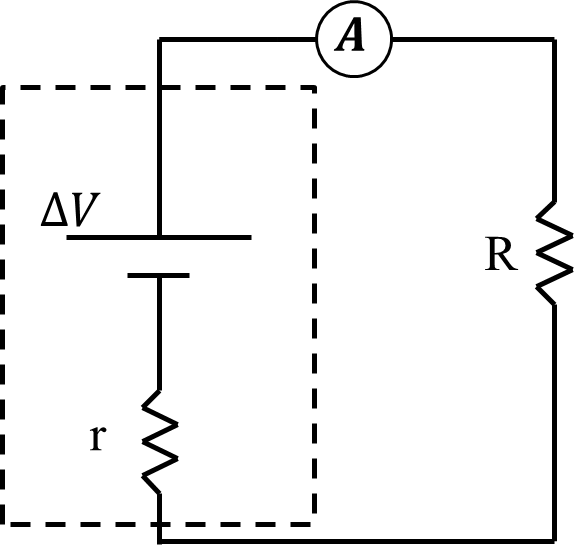

*Suggested Time: 25-30 minutes*

3.) In a laboratory experiment, a group of students are investigating
Kirchoff's Junction Rule in a parallel circuit. They have access to two
different resistors, a battery, and several digital multimeters. The
base circuit they are using is shown below.

{width="4.3244903762029745in"
height="2.7620286526684166in"}

a.) **Design** an experimental procedure the students could use to
collect data that would allow them to determine experimentally whether
or not Kirchoff's Junction Rule holds for this circuit . Clearly explain
how the equipment presented above should be used to collect the
necessary measurements, and **draw** the placement of any required
multimeters on the figure above. Make sure to provide enough detail so
that the experiment could be replicated, including any steps necessary
to reduce experimental uncertainty.

b.) **Describe** how the data could be analyzed to determine whether or
not Kirchoff's Junction Rule is satisfied experimentally for this
circuit

c.) Another group of students are investigating Kirchoff's Loop Rule in
a series circuit. The students construct the following circuit
containing a known resistance of $R = 20\ \Omega$ in series with a
variable power supply of internal resistance $r$ which the students wish
to calculate.

{width="4.410773184601925in"
height="4.192135826771653in"}

To accomplish this task, the students vary the power supply voltage
$\Delta V$, and record the total amount current $I$ within the circuit
containing the power supply and the $20\ \Omega$ resistor. The value of
$\Delta V$ is measured before the power supply is connected to the
circuit in each trial. The students' experimental data is shown below.

  ---------------------------------------------------------------------------
  $\Delta V\ (Volts)$   $I\ (Amps)$                         
  --------------------- ----------------- ----------------- -----------------
  1                     0.03                                

  2                     0.07                                

  3                     0.08                                

  4                     0.10                                

  5                     0.15                                
  ---------------------------------------------------------------------------

> i.) What quantities could be graphed to yield a straight line that
> could be used to calculate an experimental value for the internal
> resistance $r$ of the power supply?
>
> Horizontal Axis:\_\_\_\_\_\_\_\_\_\_ Vertical
> Axis:\_\_\_\_\_\_\_\_\_\_
>
> Use the remaining columns in the table, as needed, to record any
> quantities indicated that are not already provided in the table.
> **Label** each column and include units.
>
> ii.) On the grid, **plot** the data points for the quantities
> indicated in part (c)(i). Clearly **scale** and **label** all axes,
> including units as appropriate. On the same grid, **draw** a straight
> line that best represents the data.
>
> {width="6.098958880139983in"
> height="4.69919728783902in"}

d.) Using the line drawn in part (c)(ii), and the given value
$R = 20\ \Omega$, **calculate** an experimental value for the total
internal resistance $r$ of the power supply
