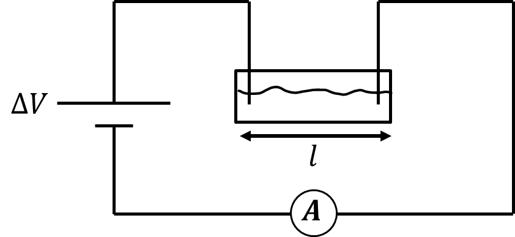

*Suggested Time: 25-30 minutes*

3.) Suppose a group of students are investigating the factors that
affect the resistance of a cylinder of modeling clay. The clay is highly
moldable, meaning the students can create cylindrical resistors of
various lengths and areas. The students hypothesize that the resistance
of each cylinder is inversely proportional to the square of each
cylinder's cross-sectional area.

{width="3.5520833333333335in"
height="0.6771391076115486in"}

a.) **Design** an experimental procedure the students could use to
collect data that would allow them to test their hypothesis. Clearly
explain how the equipment presented above should be used to collect the
necessary measurements, and provide enough detail so that the experiment
could be replicated, including any steps necessary to reduce
experimental uncertainty.

b.) **Describe** how the data could be analyzed using a graph to
determine whether or not the resistance of each cylinder is inversely
proportional to the square of its cross-sectional area

c.) Another group of students is performing an experiment to calculate
the resistivity $\rho$ of an ohmic sports drink. In their experiment,
they extend an adjustable measuring spoon of constant cross sectional
area $A_{Spoon} = 2 \times 10^{- 4}\ \ m^{2}$ to different lengths $l$
before filling the spoon with the sports drink. The students then apply
a constant voltage of $\Delta V = 9\ V$ to opposite ends of the spoon
before recording the total current $I$ flowing through the sports drink.

{width="6.442708880139983in"
height="2.957308617672791in"}

The students' experimental data is shown below:

  -----------------------------------------------------------------------------------
  $l\ (meters)$     $I\ (10^{- 4} \times Amps)$                     
  ----------------- ----------------------------- ----------------- -----------------
  0.01              35                                              

  0.02              20                                              

  0.03              10                                              

  0.04              9                                               

  0.04              7.5                                             
  -----------------------------------------------------------------------------------

> i.) What quantities could be graphed to yield a straight line that
> could be used to calculate an experimental value for the resistivity
> $\rho$?
>
> Horizontal Axis:\_\_\_\_\_\_\_\_\_\_ Vertical
> Axis:\_\_\_\_\_\_\_\_\_\_
>
> Use the remaining columns in the table, as needed, to record any
> quantities indicated that are not already provided in the table.
> **Label** each column and include units.
>
> ii.) On the grid, **plot** the data points for the quantities
> indicated in part (c)(i). Clearly **scale** and **label** all axes,
> including units as appropriate. On the same grid, **draw** a straight
> line that best represents the data.
>
> {width="6.098958880139983in"
> height="4.69919728783902in"}

d.) Using the line drawn in part (c)(ii), along with the given values of
$\Delta V = 9\ V\ $and $A_{Spoon} = 2 \times 10^{- 4}\ \ m^{2}$,
**calculate** an experimental value for the resistivity $\rho$.
