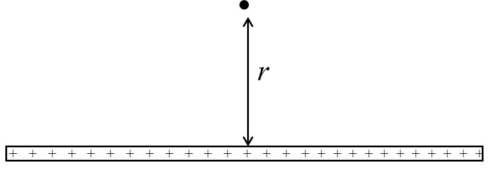
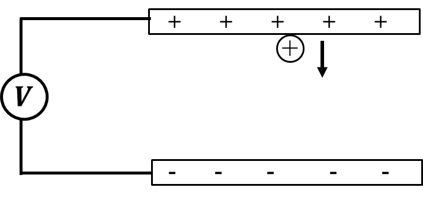

*Suggested Time: 25-30 minutes*

2.) In a laboratory experiment, a group of students are investigating
the electric field generated by a thin rod of uniform charge. The
students have access to an electric field probe which is capable of
reporting the net electric field strength at a given location.

{width="5.934323053368329in"
height="2.0641119860017496in"}

a.) The students hypothesize that the electric field generated by the
rod at a point is inversely proportional to the square root of the
point's perpendicular distance from the rod. **Design** an experiment
that the students could perform that would produce data that could be
analyzed to evaluate their claim. Make sure to provide enough detail so
that the experiment could be replicated, including any steps necessary
to reduce experimental uncertainty.

b.) **Describe** how the data collected in part (a.) could be analyzed
using a graph in order to evaluate the students' claim.

c.) In a different experiment, another group of students are
investigating the relationship between electric potential and the final
velocity of a charged ion. In this experiment, a stream of
positively-charged ions of unknown mass and charge are accelerated from
rest between two charged plates. The magnitude of the potential
difference $V$ between each plate is altered, and the average impact
velocity $v_{f}$ of each ion is measured. The students wish to calculate
the mass-to-charge ratio of the ions.

{width="5.740721784776903in"
height="2.679003718285214in"}

  -----------------------------------------------------------------------------------
  $\Delta V\ (Volts)$   $v_{f}\ (10^{6}*\ m/s)$                     
  --------------------- ------------------------- ----------------- -----------------
  1000                  1.39                                        

  2000                  1.96                                        

  3000                  2.40                                        

  4000                  2.78                                        

  5000                  3.10                                        
  -----------------------------------------------------------------------------------

> i.) What quantities could be graphed to yield a straight line that
> could be used to calculate an experimental value for the
> mass-to-charge ratio of the ion?
>
> Horizontal Axis:\_\_\_\_\_\_\_\_\_\_ Vertical
> Axis:\_\_\_\_\_\_\_\_\_\_
>
> Use the remaining columns in the table, as needed, to record any
> quantities indicated that are not already provided in the table.
> **Label** each column and include units.
>
> ii.) On the grid, **plot** the data points for the quantities
> indicated in part (c)(i). Clearly **scale** and **label** all axes,
> including units as appropriate. On the same grid, **draw** a straight
> line that best represents the data.
>
> {width="6.098958880139983in"
> height="4.69919728783902in"}

d.) Using the line drawn in part (c)(ii), **calculate** an experimental
value for the mass-to charge ratio of the ions.
