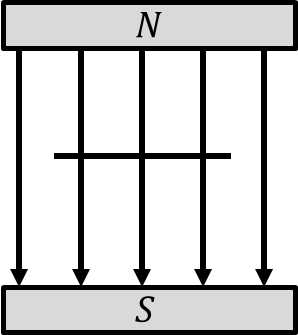

*Suggested Time: 25-30 minutes*

3.) Suppose a group of students wish to determine the inductance of a
homemade solenoid. The students have access to standard circuit
equipment and sensors available in an introductory physics laboratory.
The length, cross sectional area, and number of turns in the solenoid
remain fixed.

a.) **Design** an experimental procedure the students could use to
collect data that would allow them to calculate a value for the
solenoid's inductance using a circuit. Clearly explain how the equipment
presented above should be used to collect the necessary measurements,
and provide enough detail so that the experiment could be replicated,
including any steps necessary to reduce experimental uncertainty.

b.) **Describe** how the data could be analyzed using a graph in order
to calculate the inductance of the solenoid.

c.) Another group of students bend a set of resistive wire into a square
loop of side length $l = 0.10\ m$. The students place the loop between
the poles of an electromagnet. The magnet produces a uniform field
$B(t)$ perpendicular to the loop which increases from $B = 0$ to
$B = B_{Max}$ linearly over a fixed time $t = 0.5\ s$. A side view and
top-down view of the loop are shown below.\
{width="1.53125in"
height="1.7215748031496063in"}

{width="1.4193547681539807in"
height="1.71875in"}

The students alter the value of $B_{Max}$, and record the average
current $I$ induced in the loop while the magnetic field increases in
strength.

  -----------------------------------------------------------------------
  $B_{Max}\ (T)$    $I\ (\mu A)$                        
  ----------------- ----------------- ----------------- -----------------
  0.01              4                                   

  0.02              8                                   

  0.03              10                                  

  0.04              15                                  

  0.05              20                                  
  -----------------------------------------------------------------------

> i.) What quantities could be graphed to yield a straight line that
> could be used to calculate an experimental value for the resistance
> $R$ of the loop?
>
> Horizontal Axis:\_\_\_\_\_\_\_\_\_\_ Vertical
> Axis:\_\_\_\_\_\_\_\_\_\_
>
> Use the remaining columns in the table, as needed, to record any
> quantities indicated that are not already provided in the table.
> **Label** each column and include units.
>
> ii.) On the grid, **plot** the data points for the quantities
> indicated in part (c)(i). Clearly **scale** and **label** all axes,
> including units as appropriate. On the same grid, **draw** a straight
> line that best represents the data.
>
> {width="6.098958880139983in"
> height="4.69919728783902in"}

d.) Using the line drawn in part (c)(ii), along with the given values
$l = 0.10\ m$ and $t = 0.5\ s$ **calculate** an experimental value for
$R$
