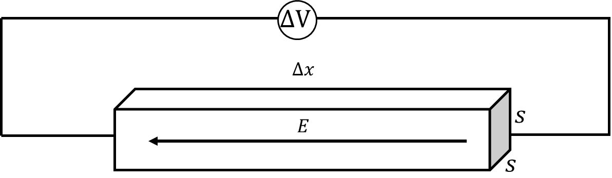

*Suggested Time: 20-25 minutes*

1.) Consider a conducting slab with a square base of side length $s$ and
thickness $\Delta x\ $as shown in the figure below. The slab carries a
constant current $I$, and there is a uniform electric field of magnitude
$E$ that points to the left at all points inside of the slab.

{width="6.015625546806649in"
height="1.7352766841644793in"}

a.)

> i.) **Derive** an expression for the constant resistivity $\rho$ of
> the slab in terms of the given quantities. Begin your derivation by
> writing a fundamental physics principle or an equation from the
> reference book.
>
> Suppose the current $I$ is generated by $N$ total free electrons
> distributed uniformly throughout the slab's volume.
>
> ii.) Consider one such electron that is located at the center of the
> slab.
>
> {width="4.984375546806649in"
> height="1.0463987314085739in"}
>
> **Draw** and **label** arrows that represent the forces (not
> components) that are exerted on the electron at this time. Each force
> in your diagram must be represented by a distinct arrow starting on,
> and pointing away from, the dot. Ignore gravitational effects and the
> electrostatic repulsion between neighboring electrons.
>
> {width="2.6354166666666665in"
> height="2.4895833333333335in"}
>
> iii.) **Derive** an expression for the magnitude of the average drift
> velocity $v_{d}$ of the electrons.

b.) A voltmeter is connected to opposite ends of the slab, as shown
below.

{width="7.2607928696412944in"
height="2.106095800524934in"}

**Determine** the magnitude of the reading $\Delta V$ on the voltmeter,
and indicate which side of the slab is at a higher electric potential.
**Justify** your answer.
