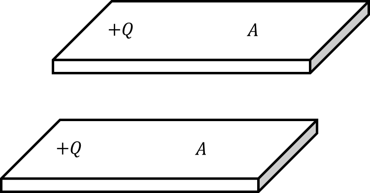
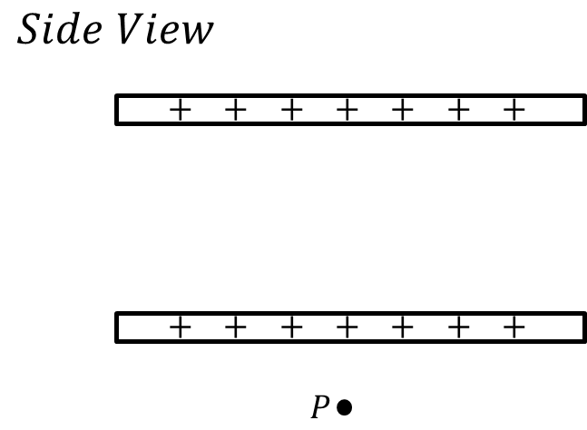
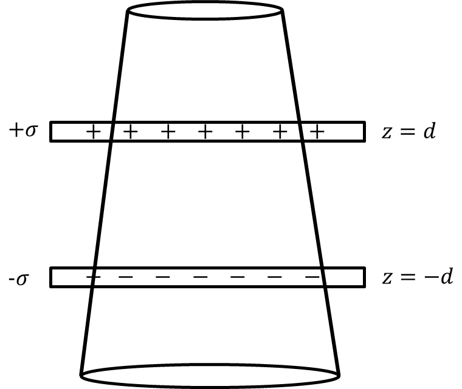

*Suggested Time: 20-25 minutes*

1.) In the setup shown below, two very large plates of area $A$ hold the
same total charge $Q$.

{width="3.5781255468066493in"
height="1.8632206911636044in"}

a.) Suppose we are interested in finding the net electric field at Point
P, which is a small distance $z_{0}$ below the bottom plate. Assume that
$z_{0}$ is significantly smaller than the dimensions of the plates, so
that we can model each plate as being infinitely large. A side view of
the plates are shown
below:{width="3.9531255468066493in"
height="2.902723097112861in"}

> i.) On the diagram above, **draw** a Gausian surface that can be used
> to calculate the electric field at Point P due to *one* of the plates.
> **Label** any relevant geometric parameters on your surface

ii.) **Derive** an expression for the magnitude of the net electric
field at Point P due to *both* plates. Begin your derivation by writing
a fundamental physics principle or an equation from the reference book.

iii.) Let the electric field magnitude from the previous part be denoted
by $E$. A small particle of mass $m$ and charge $- q$ is placed at Point
P and released from rest. **Derive** an expression for the work done by
the electric force as the test charge is moved from Point P to the
bottom plate in terms of the given quantities. Begin your derivation by
writing a fundamental physics principle or an equation from the
reference book.

b.) Suppose the plates in the previous setup are replaced by two
infinite parallel plates holding equal and opposite uniform area charge
density $\pm \sigma$. The plates are centered at $z = 0$, and have
separation $2d$. Consider the following surface whose circular cross
sections have varying radius according to the expression $r(z) = (4 -$
$\frac{z}{d}$$)R$

{width="4.651042213473316in"
height="3.899646762904637in"}

**Derive** an expression for the magnitude of the net electric flux
through this surface. Begin your derivation by writing a fundamental
physics principle or an equation from the reference book.
