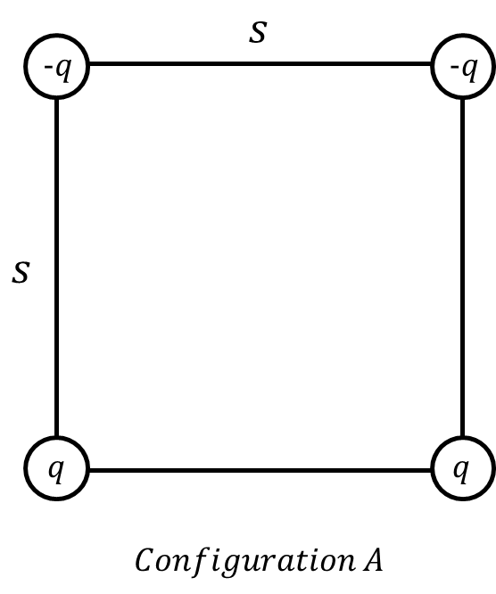
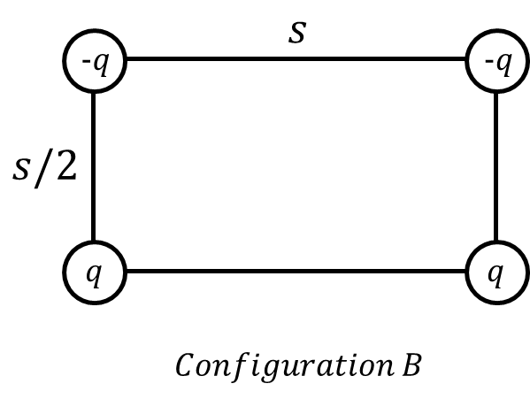

*Suggested Time: 15-20 minutes*

4.) Consider the following two arrangements of charges shown below. In
*Configuration A*, four charges are arranged into a square of side
length $s$. In *Configuration B*, the same charges are arranged into a
rectangle of length $s$ and height $s/2$.
{width="2.9480008748906386in"
height="3.5243733595800526in"}

{width="3.401042213473316in"
height="2.558047900262467in"}

a.) Taking the potential energy to be zero at infinity, **compare** the
total electric potential energy of the system $U$ between all of the
point charges in each configuration. **Justify** your answer without
manipulating equations.

\_\_\_\_\_\_\_\_\_\_ $U_{A} > U_{B}$

\_\_\_\_\_\_\_\_\_\_ $U_{A} < U_{B}$

\_\_\_\_\_\_\_\_\_\_ $U_{A} = U_{B}$

b.) Suppose that the charge distribution is released from rest in
*Configuration A*, and some time later, the system enters *Configuration
B*. **Derive** an expression for ${\Delta K}_{AB}$, the total change in
kinetic energy of the system during this process. Begin your derivation
by writing a fundamental physics principle or an equation from the
reference book.

c.) Is your expression derived in part (b.) consistent with your
selection in part (a.)? **Justify** your answer.
