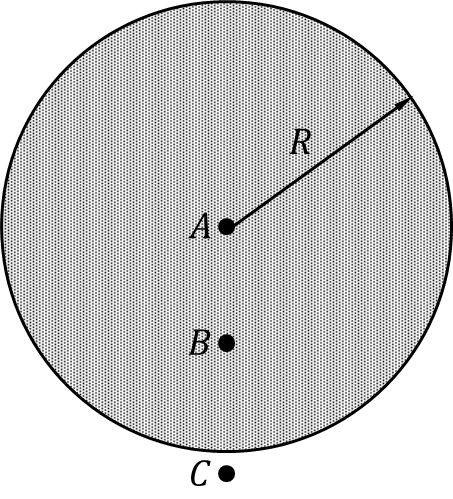

*Suggested Time: 15-20 minutes*

4.) An insulating sphere of radius $R$ contains a non-uniform volumetric
charge density dependent on the distance $r$ from the sphere's center
given by the expression $\rho(r) = Ar$ for $0 \leq r \leq R$. Point A is
located at the center of the sphere, Point B is located at a distance
$\frac{R}{2}$ from the center of the sphere, and Point C is located a
small distance $( < < R)$ outside the surface of the sphere.
{width="2.9531255468066493in"
height="3.247260498687664in"}

a.) **Rank** the electric field magnitudes at each point, $E_{A}$,
$E_{B}$, and $E_{C}$. **Justify** your ranking without deriving an
expression for each quantity.

b.) **Derive** an expression for the electric field strength as a
function of $r$ inside the sphere. Begin your derivation by writing a
fundamental physics principle or an equation from the reference book.

c.) Suppose the sphere holds the same total charge, but is now a
conductor. **Rank** the values of $E_{A}$, $E_{B}$, and $E_{C}$ in this
case.
