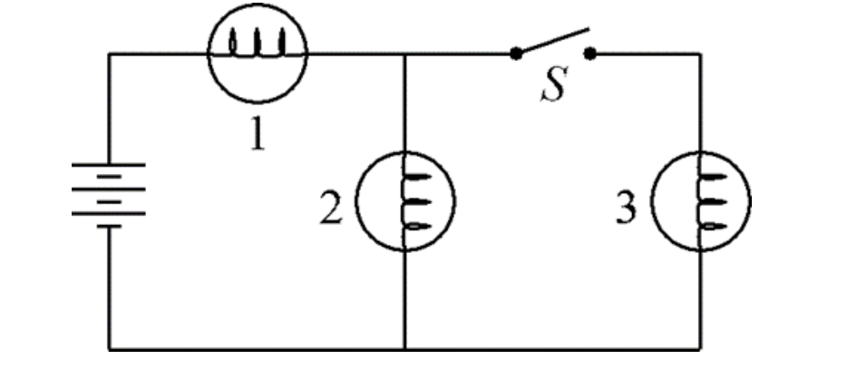

*Suggested Time: 15-20 minutes*

4.) A circuit contains three identical light bulbs of resistance $R$
connected to a battery of emf $\varepsilon$as shown in the diagram
below. The switch $S$ is initially open.

{width="5.880208880139983in"
height="2.605155293088364in"}

a.) Suppose the switch is now closed.

> i.) **Indicate** whether the brightness of each bulb will increase,
> decrease or stay the same compared to the time before the switch is
> closed.

  -----------------------------------------------------------------------
  **Bulb**      **Brightness After Switch is Closed**
  ------------- ---------------------------------------------------------
  1             Increases Decreases Stays the Same

  2             Increases Decreases Stays the Same

  3             Increases Decreases Stays the Same
  -----------------------------------------------------------------------

> ii.) **Justify** your choice for each bulb's brightness change without
> manipulating equations

b.) When the switch is open, the magnitude of the potential difference
across Bulb 1 is $\Delta V_{1,\ O}$, and when the switch is closed, the
magnitude of the potential difference across Bulb 1 is
$\Delta V_{1,\ C}$

**Calculate** the ratio $\frac{\Delta V_{1,\ C}}{\Delta V_{1,\ O}}$

c.) Is your derived ratio in part (b.) consistent with your selection in
part (a.)? **Justify** your answer, making sure to reference how the
ratio relates to the brightnesses of *all three bulbs*.
