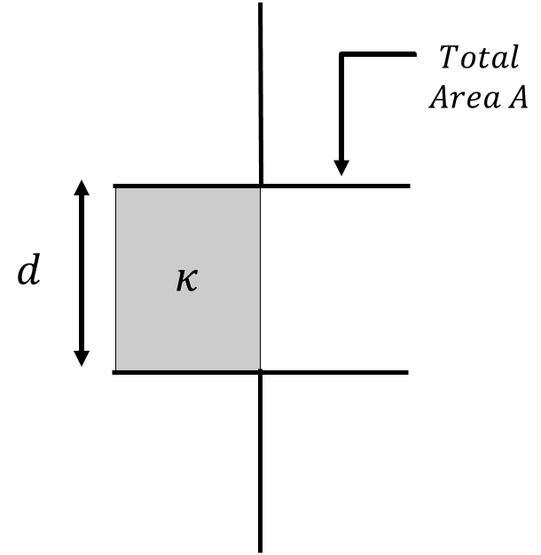
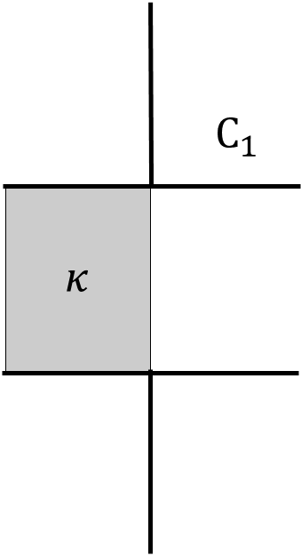
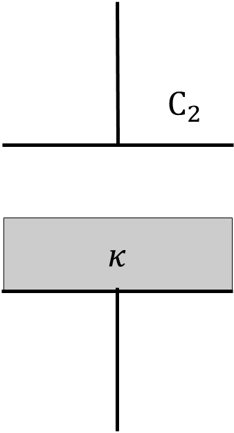

*Suggested Time: 15-20 minutes*

4.) A capacitor is constructed using two parallel plates of area $A$
that are separated by a distance $d$. An insulating material of
dielectric constant $\kappa$ is inserted between the plates which spans
the entire distance between the plates, but only half of the total area.
The capacitor is charged using a battery, and then the battery is
disconnected.

{width="2.8551115485564305in"
height="2.888439413823272in"}

a.) Suppose that after the capacitor is charged and the battery is
disconnected, the dielectric is also removed by an external agent.

**Indicate** whether the energy stored by the capacitor will increase,
decrease, or remain constant after the dielectric is removed.

\_\_\_\_\_\_\_\_\_\_ The stored energy will increase

\_\_\_\_\_\_\_\_\_\_ The stored energy will decrease

\_\_\_\_\_\_\_\_\_\_ The stored energy will remain constant

**Justify** your answer without referencing equations.

b.) Let $U_{0}$ represent the potential energy stored by the capacitor
once the dielectric is removed, and $U_{\kappa}$ represent the potential
energy stored by the capacitor with the dielectric inserted. **Derive**
an expression for the ratio $\frac{U_{0}}{U_{\kappa}}$ in terms of
$\kappa$

c.) Let $C_{1}$ represent the capacitor with the dielectric inserted in
its original orientation. Suppose in a new capacitor $C_{2}$ of
identical geometry, the dielectric now spans the entire area of the
capacitor plates, but only half of the plate separation.

{width="1.5971992563429571in"
height="2.943063210848644in"}{width="1.59375in"
height="2.944796587926509in"}

If both capacitors are isolated and given equal initial charges before
being connected to the same resistive load, which capacitor will take
longer to release half of its stored energy? **Justify** your answer.
