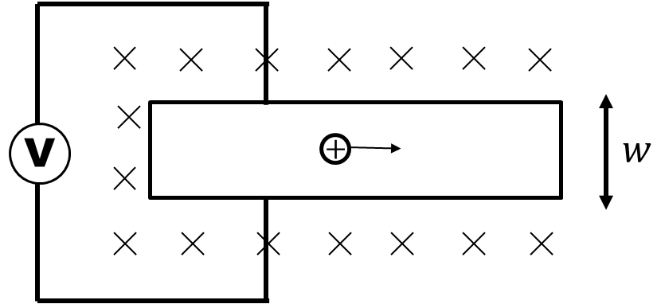

*Suggested Time: 15-20 minutes*

4.) Suppose a long conducting bar carries a stream of positive ions
moving to the right. The conductor is then placed in a uniform magnetic
field of magnitude $B$ directed into the plane of the figure as shown
below. A voltmeter is then connected across the width $w$ of the
conductor, and the potential difference
$\Delta V = V_{Top} - V_{Bottom}$ is recorded between the top and bottom
of the bar.

{width="4.192708880139983in"
height="1.9208880139982503in"}

a.) **Indicate** the relationship between $V_{Top}$ and $V_{Bottom}$

\_\_\_\_\_\_\_\_\_\_ $V_{Top}\  > \ V_{Bottom}$

\_\_\_\_\_\_\_\_\_\_ $V_{Top}\  < \ V_{Bottom}$

\_\_\_\_\_\_\_\_\_\_ $V_{Top}\  = \ V_{Bottom}$

**Justify** your answer without referencing equations

b.) **Derive** an expression for the average drift velocity $v$ of the
ions in the bar in terms of the given quantities $\Delta V$, $B$, $w$
and physical constants. Begin your derivation by writing a fundamental
physics principle or an equation from the reference book.

c.) Suppose the magnetic field direction was changed such that it now
points to the left inside the conductor. **Indicate** the relationship
between $V_{Top}$ and $V_{Bottom}$ in this modified scenario.

\_\_\_\_\_\_\_\_\_\_ $V_{Top}\  > \ V_{Bottom}$

\_\_\_\_\_\_\_\_\_\_ $V_{Top}\  < \ V_{Bottom}$

\_\_\_\_\_\_\_\_\_\_ $V_{Top}\  = \ V_{Bottom}$

**Justify** your answer without referencing equations
