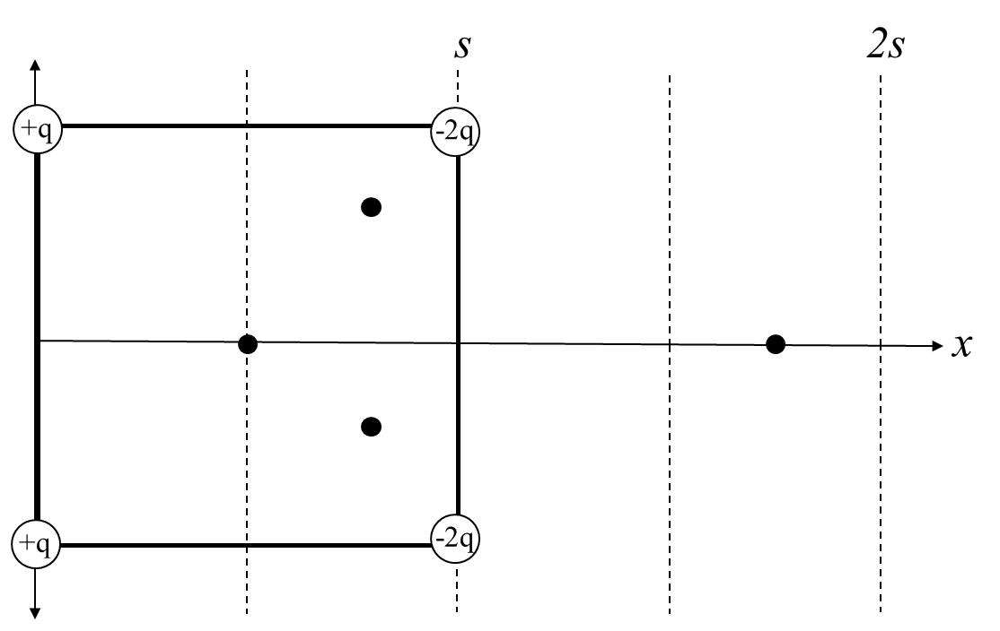
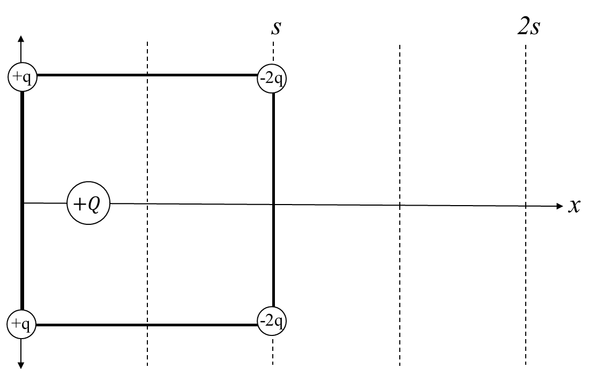

*Suggested Time: 25-30 minutes*

2.) Four particles are placed along the vertices of a square of side
length $s$ which is centered on the x-axis. There are two particles
located on the line $x = 0$ each have positive charge $q$, and the two
particles located on the line $x = s$ each have a negative charge $- 2q$

{width="7.169081364829396in"
height="4.5411504811898515in"}

a.) On each of the four points placed on the figure above, qualitatively
**draw** the direction of the net electric field at each position.

b.) **Derive** an expression for the magnitude of the net electric field
at the center of the square. Begin your derivation from a fundamental
physics principle or equation from the reference book.

c.) Suppose a fifth particle of positive charge $Q$ can be given an
initial position $x$ along the x-axis, while the original four charges
remain fixed in place.
{width="5.991404199475066in"
height="3.782343613298338in"}

Let $U$ represent the total electric potential energy of the newly added
particle of charge $Q$ due to the other four charges. **Sketch** a
qualitative graph $U$ as function of this new charge's position $x$ on
the interval $0 \leq x \leq 2s$. Take the electric potential energy to
be equal to zero at infinity.

{width="3.9441010498687663in"
height="4.298747812773403in"}

d.) The newly added particle of positive charge $Q$ is placed at the
position $x = s$ and given an initial velocity $+ v_{1}\ \widehat{i}$.
Once the positive charge reaches the position $x = 1.5\ s$, it has a
nonzero velocity ${+ v}_{2}\ \widehat{i}$, where $v_{1}$ and $v_{2}$ are
positive constants.

> i.) How does $v_{1}$ compare to $v_{2}$?
>
> \_\_\_\_\_\_\_\_\_\_ $v_{1} < \ v_{2}$ \_\_\_\_\_\_\_\_\_\_
> $v_{1} = \ v_{2}$ \_\_\_\_\_\_\_\_\_\_ $v_{1} > \ v_{2}$
>
> ii.) **Justify** whether this selection is consistent with your graph
> drawn in part (c)
