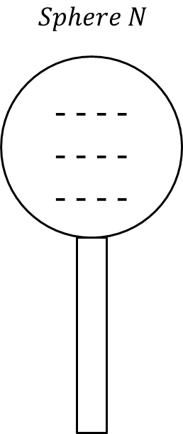
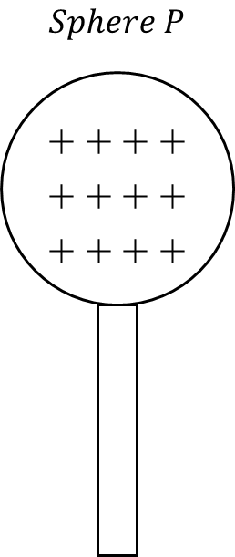
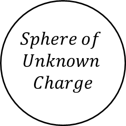

*Suggested Time: 25-30 minutes*

2.) Suppose a group of students wish to determine the type of charge on
an insulating sphere. It is unknown whether the sphere is positively
charged, negatively charged, or neutral. The students also have access
to two additional spheres whose net charges are known. *Sphere P*, which
is positively charged, and *Sphere N*, which is negatively charged.

{width="1.4166666666666667in"
height="3.3584765966754158in"}{width="1.4114588801399826in"
height="3.346129702537183in"}

{width="1.3093438320209974in"
height="1.2976531058617673in"}

a.) **Design** an experimental procedure that the students could perform
in order to determine the type of net charge on the sphere (if any).
Make sure to provide enough detail so that the experiment could be
replicated. Explicitly mention how *Sphere P* and/or *Sphere N* should
be used in the experiment.

b.) **Describe** how the results of the procedure in part (a.) could be
analyzed in order to determine the type of charge on the sphere (if
any).

c.) In another experiment, students measure the force of electrostatic
repulsion between two positively charged insulating spheres. The
students record the charges $Q_{1}$ and $Q_{2}$ on each sphere, and
attach a force meter to one of the spheres in order to record the force
of electrostatic repulsion $F$ between the spheres while the spheres are
held at a constant center-to-center distance $d = 0.1\ m$ apart. The
students wish to calculate the permittivity of free space,
$\varepsilon_{0}$. The students' data is shown below:

  -------------------------------------------------------------------------
  $Q_{1}\ (\mu C)$   $Q_{2}\ (\mu C)$   $F$ ($N$)         
  ------------------ ------------------ ----------------- -----------------
  6                  3                  15                

  5                  4                  18                

  2                  5                  10                

  1                  6                  5                 

  5                  7                  30                
  -------------------------------------------------------------------------

> i.) What quantities could be graphed to yield a straight line that
> could be used to calculate an experimental value for the permittivity
> of free space, $\varepsilon_{0}$?
>
> Horizontal Axis:\_\_\_\_\_\_\_\_\_\_ Vertical
> Axis:\_\_\_\_\_\_\_\_\_\_
>
> Use the remaining columns in the table, as needed, to record any
> quantities indicated that are not already provided in the table.
> **Label** each column and include units.
>
> ii.) On the grid, **plot** the data points for the quantities
> indicated in part (c)(i). Clearly **scale** and **label** all axes,
> including units as appropriate. On the same grid, **draw** a straight
> line that best represents the data.
>
> {width="6.098958880139983in"
> height="4.69919728783902in"}

d.) Using the line drawn in part (c)(ii), and the given value
$d = 0.1\ m$, **calculate** an experimental value for the permittivity
of free space, $\varepsilon_{0}$
