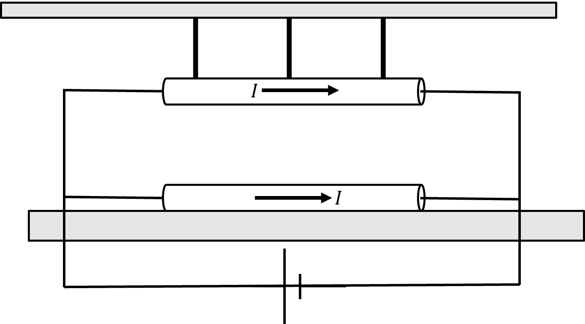

*Suggested Time: 25-30 minutes*

3.) Suppose a group of students are presented with two vertically
aligned parallel wires of known length $l$ that are carrying equal
horizontal currents $I$ that can be turned on and off using a switch
(not shown). The students can adjust the distance $d$ between the wires
using strings of adjustable length, and have access to a force sensor.
The students wish to determine the value of $I$ without disconnecting
any element of the circuit. The students do not have multimeters. The
experimental setup is shown below.

{width="5.637295494313211in"
height="3.134841426071741in"}

a.) **Design** an experimental procedure the students could use to
collect data that would allow them to use a graph to calculate the value
of the current $I$ carried by each wire. Clearly explain how the
equipment presented above should be used to collect the necessary
measurements.

b.) **Describe** how the data could be analyzed using a graph to
calculate the value of $I$

c.) Another group of students are attempting to use a solenoid to
calculate the value of the vacuum permeability $\mu_{0}$. In their
experiment, the students vary the length $l$ of a metal coil with a
constant $N =$ 100 turns, and record the magnetic field strength $B$ in
the center of the coil after supplying a constant current of
$I = 0.75\ A$. The data collected by the students is shown below.

  -----------------------------------------------------------------------
  $l\ (m)$          $B\ (\mu T)$                        
  ----------------- ----------------- ----------------- -----------------
  0.2               460                                 

  0.4               225                                 

  0.6               170                                 

  0.8               130                                 

  1.0               97                                  
  -----------------------------------------------------------------------

> i.) What quantities could be graphed to yield a straight line that
> could be used to calculate an experimental value for $\mu_{0}$ ?
>
> Horizontal Axis:\_\_\_\_\_\_\_\_\_\_ Vertical
> Axis:\_\_\_\_\_\_\_\_\_\_
>
> Use the remaining columns in the table, as needed, to record any
> quantities indicated that are not already provided in the table.
> **Label** each column and include units.
>
> ii.) On the grid, **plot** the data points for the quantities
> indicated in part (c)(i). Clearly **scale** and **label** all axes,
> including units as appropriate. On the same grid, **draw** a straight
> line that best represents the data.
>
> {width="6.098958880139983in"
> height="4.69919728783902in"}

d.) Using the line drawn in part (c)(ii) along with the given values of
$N = 100$ and $I = 0.75\ A$, **calculate** an experimental value for
$\mu_{0}$
