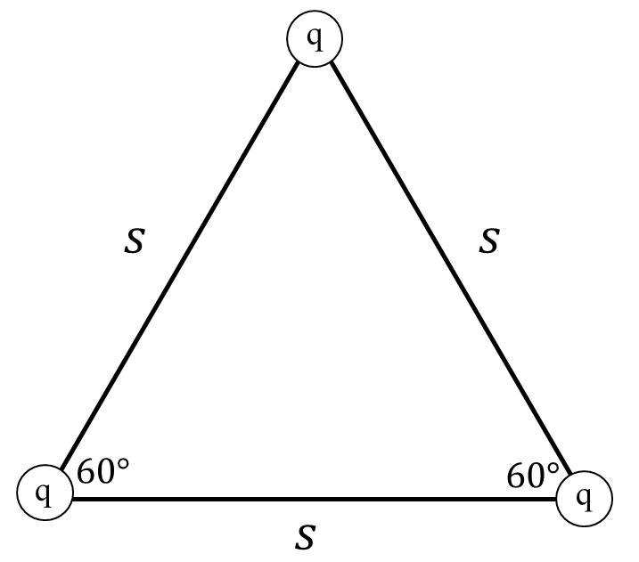

*Suggested Time: 20-25 minutes*

1.) Three identical charges $+ q$ are placed along the vertices of an
equilateral triangle with side length *s*, as shown in the figure below

{width="4.554525371828522in"
height="4.004375546806649in"}

a.)

> i.) On the figure below, **draw** the direction of the net electric
> force acting on the top
> charge{width="2.877340332458443in"
> height="2.7181200787401574in"}
>
> ii.) **Derive** an expression for the magnitude of the amount of work
> $W$ required from an external force to assemble this charge
> distribution from a very far distance away. Begin your derivation by
> writing a fundamental physics principle or an equation from the
> reference book.
>
> iii.) **Derive** an expression for the magnitude of the net electric
> force $F_{E}$ acting on the charge placed at the top vertex of the
> triangle. Begin your derivation by writing a fundamental physics
> principle or an equation from the reference book.

b.) Suppose the top charge is released from rest, while the bottom
charges remain stationary. **Derive** an expression for the velocity $v$
of the top charge once it reaches a distance very far away from the
other two point charges, given that the charge $q$ has a mass $m$. Begin
your derivation by writing a fundamental physics principle or an
equation from the reference book.
