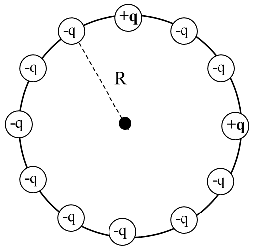
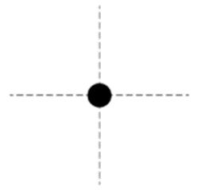
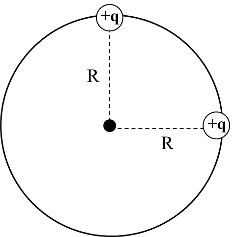

*Suggested Time: 20-25 minutes*

1.) Twelve point charges are placed at equal distances around a circle
of radius $R$. The charges at the "twelve-o'clock" and "three-o'clock"
positions have a charge $+ q$, while the rest of the charges have a
value of $- q$, as shown in the figure below

{width="3.7562160979877515in"
height="3.6765080927384077in"}

a.)

> i.) **Derive** an expression for the magnitude of the net electric
> potential at the center of the circle. Begin your derivation by
> writing a fundamental physics principle or an equation from the
> reference book.
>
> ii.) On the diagram below, **draw** the direction of the net electric
> field at the center of the circle
>
> {width="3.4312740594925635in"
> height="3.244792213473316in"}
>
> iii.) **Derive** an expression for the magnitude of the net electric
> field at the center of the circle

b.) Suppose all of the negative charges are removed, leaving only the
two positive charges. These final two charges are then released from
rest and allowed to move apart.

{width="3.375in"
height="3.398519247594051in"}

Given that each charge has a mass $M$, **derive** an expression for the
speed of each charge after their separation distance becomes infinitely
large.
