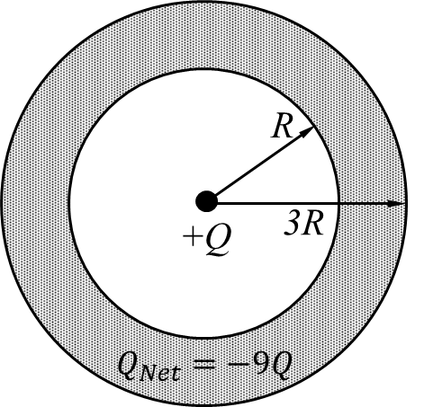
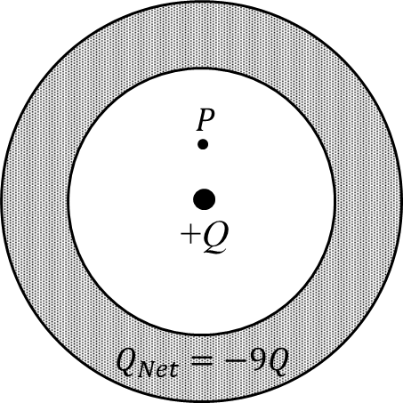

*Suggested Time: 20-25 minutes*

1.) In the charge distribution shown below, a positive charge $+ Q$ is
placed in the center of a hollow spherical cavity of radius $R$. This
hollow cavity is surrounded by a concentric spherical conducting shell
of inner radius $R$ and outer radius $3R$ as measured from the center of
the cavity. A cross section view of this distribution is shown below.

{width="2.7343755468066493in"
height="2.629542869641295in"}

a.) It is known that the shell holds a net negative charge $- 9Q$.

> i.) **Derive** an expression for the charge on the outer surface of
> the spherical shell in terms of $Q$. Begin your derivation by writing
> a fundamental physics principle or an equation from the reference
> book.
>
> ii.) When the electric field is measured at a distance $4R$ from the
> center of the cavity, the magnitude of the electric field is $E$.
> **Derive** an expression for the absolute value of $Q$ in terms of $E$
> and physical constants starting from Gauss's Law. Begin your
> derivation by writing a fundamental physics principle or an equation
> from the reference book.

b.) Consider Point P, which is placed at a distance $\frac{R}{2}$ from
the center of the cavity.

> i\) On the diagram below, **draw** the direction of the electric field
> at Point P, and **draw** the cross section of an equipotential surface
> containing Point P. If the electric field is zero, write $E = 0$ on
> Point P.
>
> {width="3.4059798775153105in"
> height="3.4059798775153105in"}
>
> ii\) A small particle with mass $m$ and charge $q$ is placed at Point
> P and given a velocity $v_{0}$ directed radially outward. **Derive**
> an expression for the particle's speed after reaching a radial
> distance $\frac{3R}{4}$ from the center of the cavity in terms of $Q$
> and the quantities given above. Begin your derivation by writing a
> fundamental physics principle or an equation from the reference book.
