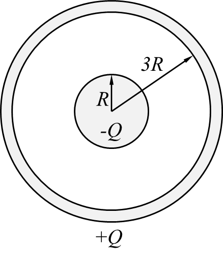
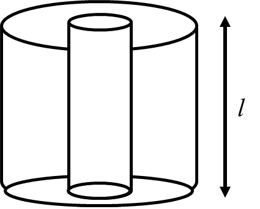
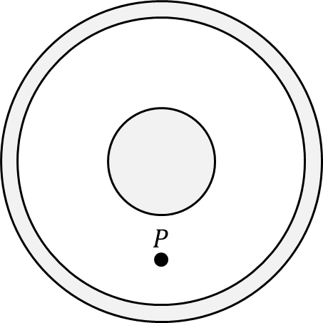

*Suggested Time: 20-25 minutes*

1.) A cylindrical capacitor is constructed using two concentric
conducting cylinders holding equal and opposite charges along their
equal lengths $l$. The inner cylinder holds a charge $- Q$ and has a
radius $R$, while the outer cylinder holds a charge $+ Q$ and has an
inner radius of $3R$.

{width="1.0677088801399826in"
height="0.35590332458442697in"}{width="1.0729166666666667in"
height="0.2784667541557305in"}

{width="2.437711067366579in"
height="2.8574496937882765in"}

{width="2.6718755468066493in"
height="2.146084864391951in"}

a.)

> i.) On the diagram below, **draw** an equipotential line containing
> point P, and **draw** the direction of the electric field at point P.
> If the electric field is zero, write $E = 0$.

{width="2.4100524934383203in"
height="2.4100524934383203in"}

> ii.) **Derive** an expression for the capacitance $C$ of this
> arrangement of concentric cylinders. Begin your derivation by writing
> a fundamental physics principle or an equation from the reference
> book.

b.) The capacitor is charged before being connected in series to an open
switch and three identical resistances $r$ wired in parallel with one
another. The switch is then closed at $t = 0$.

{width="4.791853674540683in"
height="2.5810925196850394in"}

i.) **Derive** a differential equation that could be solved to give the
amount of charge $q$ on one of the cylinders as a function of time in
terms of $r$ and $C$

ii.) **Derive** an expression for the time $t_{1/2}$ required for the
capacitor to release half of its initial stored charge in terms of $r$
and $C$.
