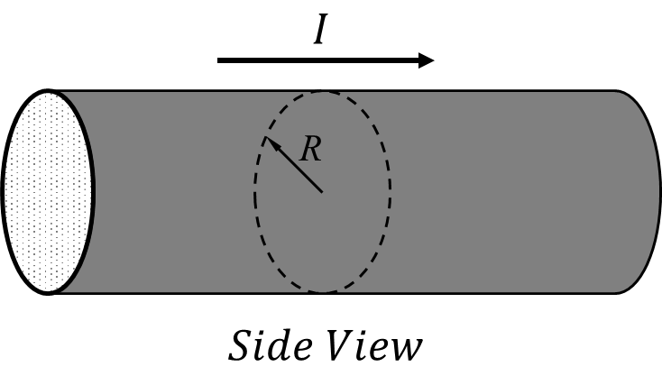
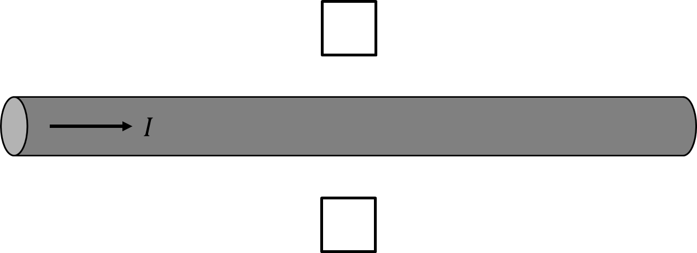
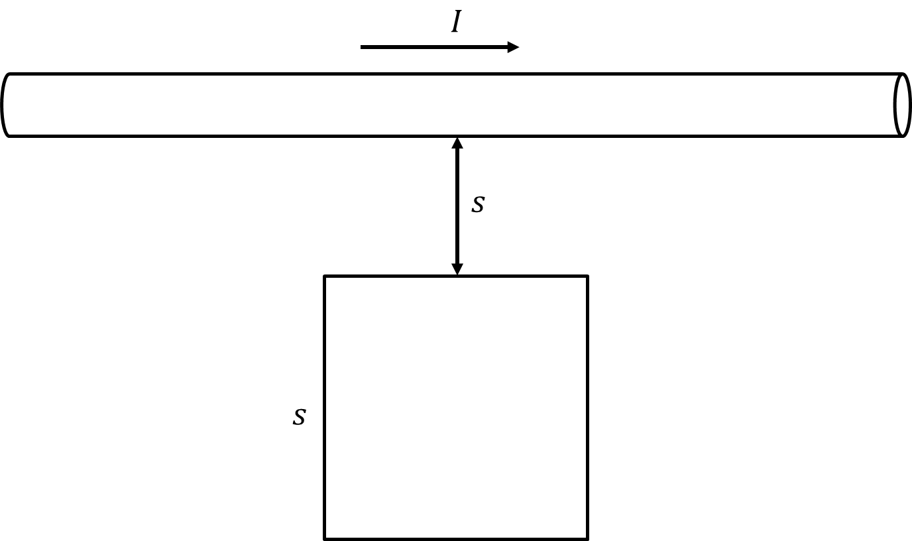

*Suggested Time: 20-25 minutes*

1.) A long cylindrical conductor of radius $R$ carries a rightward
current whose density varies with the distance $r$ from the conductor's
center according to the expression $J(r) = c\ $ for $r \leq R$

{width="3.8489588801399823in"
height="2.1850382764654417in"}

a.)

i.) Inside each of the boxes shown, **draw** the direction of the net
magnetic field generated at each location. If the magnetic field is
equal to zero at a location, write "zero" inside that box

{width="6.5in"
height="2.361111111111111in"}

ii.) Starting from Ampere's Law, **derive** an expression for the
magnitude of the magnetic field as a function of the distance $r$ for
locations inside the conductor $(r < R)$

b.) Suppose the original wire is replaced with a very thin wire that
carries a total current $I$. **Derive** an expression for the absolute
value of the total magnetic flux through a square loop of side length
$s$ whose closest side is located a perpendicular distance $s$ from the
wire as shown in the figure below. Answer in terms of $I,s$ and
appropriate constants.

{width="5.797295494313211in"
height="3.438652668416448in"}
