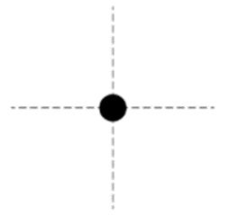

*Suggested Time: 20-25 minutes*

1.) A bulb of resistance $R$ and a conducting bar of mass $m$ and are
placed on a set of wire rails separated by a width $w$. At $t = 0$, the
bar is launched to the right at an initial velocity $v_{0}$ into a
region constant magnetic field with magnitude $B$ directed into the
plane of the figure below.

{width="3.6151279527559055in"
height="1.9624978127734034in"}

a.) After the bar is launched, there are no forces assisting the bar's
rightward motion. Consider the moment in time when the bar is moving at
a velocity $v$ to the right:

> i.) **Derive** an expression for the power dissipated by the bulb at
> this time in terms of the given quantities. Begin your derivation by
> writing a fundamental physics principle or an equation from the
> reference book.
>
> ii.) On the dot below, **draw** and label **arrows** that represent
> the forces (not components) that are exerted on the bar after it has
> been launched. Each force in your diagram must be represented by a
> distinct arrow starting on, and pointing away from, the dot.

{width="2.7656255468066493in"
height="2.613280839895013in"}

> iii.) Starting from Newton\'s Second Law, **derive** a differential
> equation which could be solved to obtain an expression for the
> velocity of the bar as a function of time.

b.) A long time after the bar is launched, it will come to a stop.
**Derive** an expression for minimum horizontal length of the rails
required to ensure that the bar can come to a complete stop without
falling off. Assume that the bar is launched from the left end of the
rails, and has negligible width.
