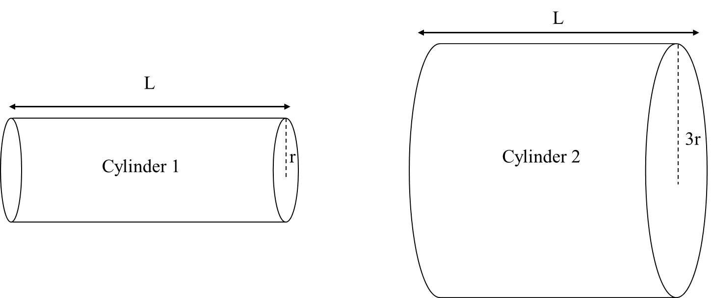

*Suggested Time: 15-20 minutes*

4.) Consider two conductive cylinders of resistivity $\rho$ and length
$L$. Cylinder 1 has a radius of $r$, and Cylinder 2 has a radius of
$3r$.
{width="6.5in"
height="2.72419072615923in"}

a.) **Indicate** which of the two cylinders will have a greater total
electrical resistance. **Justify** your choice without referencing
equations.

\_\_\_\_\_\_\_\_\_\_ Cylinder 1 has greater resistance

\_\_\_\_\_\_\_\_\_\_ Cylinder 2 has greater resistance

\_\_\_\_\_\_\_\_\_\_ Both cylinders have the same resistance

b.) **Derive** expressions for the resistance of each cylinder in terms
of $\rho,\ r,\ L,$ and physical constants. Begin your derivation by
writing a fundamental physics principle or an equation from the
reference book.

c.) **Justify** whether the equations derived in part (b) either agree
or disagree with your selection in part (a)
