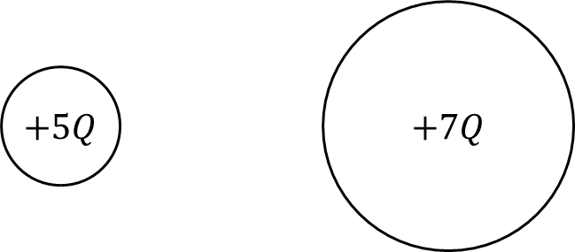
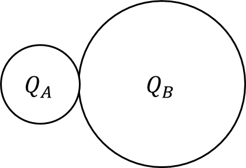
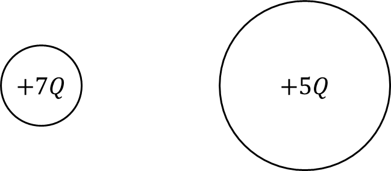

*Suggested Time: 15-20 minutes*

4.) Two conducting spheres are placed on a flat surface. Sphere A has a
radius of $R$ and holds an initial charge of $+ 5Q$. Sphere $B$ has a
radius of $3R$ and holds an initial charge of $+ 7Q$. The two spheres
are brought into contact, allowing the charge to distribute itself
amongst the two-sphere system. The spheres are allowed to each
electrostatic equilibrium, and the final net charge on sphere A and
sphere B are denoted by $Q_{A}$ and $Q_{B}$ respectively.

{width="4.926545275590551in"
height="2.1562992125984253in"}

{width="3.911619641294838in"
height="2.671349518810149in"}

a.) **Compare** the values of $Q_{A}$ and $Q_{B}$. **Justify** your
answer without manipulating equations.

\_\_\_\_\_\_\_\_\_\_ $Q_{A} > Q_{B}$

\_\_\_\_\_\_\_\_\_\_ $Q_{A} < Q_{B}$

\_\_\_\_\_\_\_\_\_\_ $Q_{A} = Q_{B}$

b.) **Derive** expressions for $Q_{A}$ and $Q_{B}$ in terms of $Q,\ R$
and physical constants. Begin your derivation by writing a fundamental
physics principle or an equation from the reference book.

c.) Suppose this experiment is repeated but the initial charges on each
sphere were swapped. Sphere A now begins with a charge of $+ 7Q$, and
Sphere B begins with a charge of $+ 5Q$ before electrical contact is
made.

{width="5.109375546806649in"
height="2.2517279090113735in"}

**Determine** the new value of $Q_{A}$ in this modified setup
