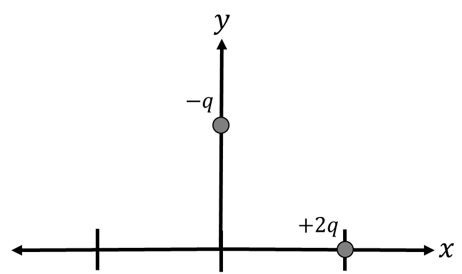
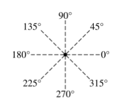
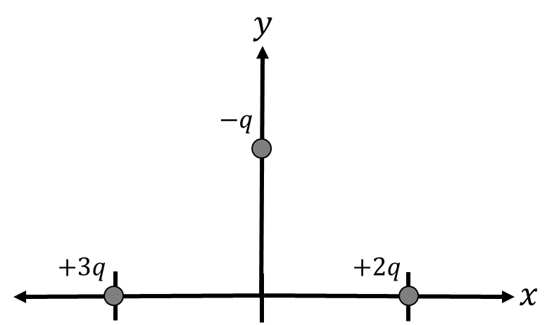

*Suggested Time: 15-20 minutes*

4.) In the charge distribution shown below, a particle of positive
charge $2q$ is placed at $x = a$, and a particle of negative charge
$- q$ is placed at $y = a$

{width="4.682779965004374in"
height="2.771669947506562in"}

a.) **Draw** the direction of the net electric field at the origin.
**Justify** your answer without referencing equations.

{width="3.4048293963254594in"
height="2.9375in"}

b.) **Derive** an expression for the magnitude of the electric field at
the origin. Begin your derivation from a fundamental physics principle
or equation from the reference book.

c.) A third particle with charge $+ 3q$ is placed at $x = \  - a$.

{width="4.713542213473316in"
height="2.796008311461067in"}

If the total electric field at the origin is now denoted by
${\overrightarrow{E}}_{new} = \overrightarrow{E_{x}}\ \ \widehat{i} + \overrightarrow{E_{y}}\ \ \widehat{j}$,
**determine** the value of the ratio
$\frac{|{\overrightarrow{E}}_{x}|}{|{\overrightarrow{E}}_{y}|}$, and
**justify** your answer without referencing equations.
