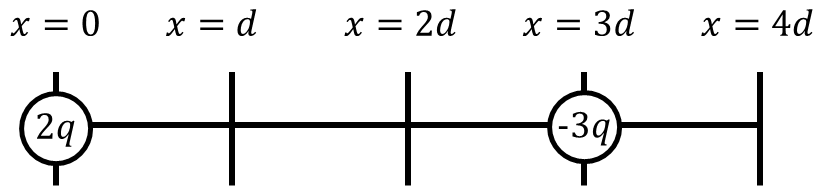

*Suggested Time: 25-30 minutes*

2.) A positive charge $2q$ is placed along the x-axis at $x = 0$, and a
negative charge $- 3q$ is placed along the x-axis at $x = 3d$

{width="5.814238845144357in"
height="1.330054680664917in"}

a.) On the diagram above, **draw** the direction of the electric field
at $x = d$, $x = 2d$, and $x = 4d$.

b.) **Derive** an expression for the net electric field strength at
$x = d$. Begin your derivation by writing a fundamental physics
principle or an equation from the reference book.

c.) **Sketch** a qualitative graph of $E_{x}$, the strength of the
x-component of the electric field in the region $0 < x < 4d$. Take a
rightward electric field to be positive, and **label** any asymptotes

{width="6.842186132983377in"
height="4.353122265966754in"}

d.) Is your graph drawn in part (c.) consistent with your diagram in
part (a.)? **Justify** your answer.
