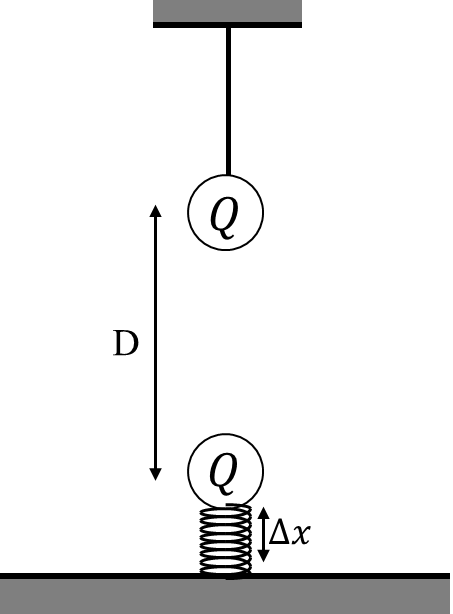

*Suggested Time: 25-30 minutes*

2.) Two identical spheres of mass $m$ and positive charge $Q$ are
vertically aligned as shown below. The top charge is suspended by a
string, and the bottom charge is placed on a spring of constant $k_{s}$
which depresses a distance $\Delta x$ from equilibrium. At this time,
both charges are at rest, and the center-to-center separation of each
sphere is $D$

{width="4.829267279090113in"
height="6.516202974628172in"}

a.) On the dots below, **draw** and label **arrows** that represent the
forces (not components) that are exerted on each sphere. Each force in
your diagram must be represented by a distinct arrow starting on, and
pointing away from, the dot. **Draw** the relative lengths of all arrows
to reflect the relative magnitudes of all the forces.

> Top Sphere Bottom Sphere

{width="3.21547353455818in"
height="3.21547353455818in"}{width="3.21547353455818in"
height="3.21547353455818in"}

b.) **Derive** an expression for $k_{s}$, the force constant of the
spring. Begin your derivation by writing a fundamental physics principle
or an equation from the reference book.

c.) **Sketch** a graph of the magnitude of the spring force $F_{s}$
acting on the bottom sphere as a function of the charge $Q$ placed on
each sphere. Assume that the distance $D$ remains constant, and is much
larger than $\Delta x$. **Label** any known intercepts.

{width="5.463542213473316in"
height="3.545688976377953in"}

d.) Suppose the sign of the charge on top sphere was changed, giving the
top sphere a charge of $- Q$. **Describe** how this change would affect
each force on your diagrams drawn in part (a.). Assume that the bottom
charge remains in contact with the spring.
