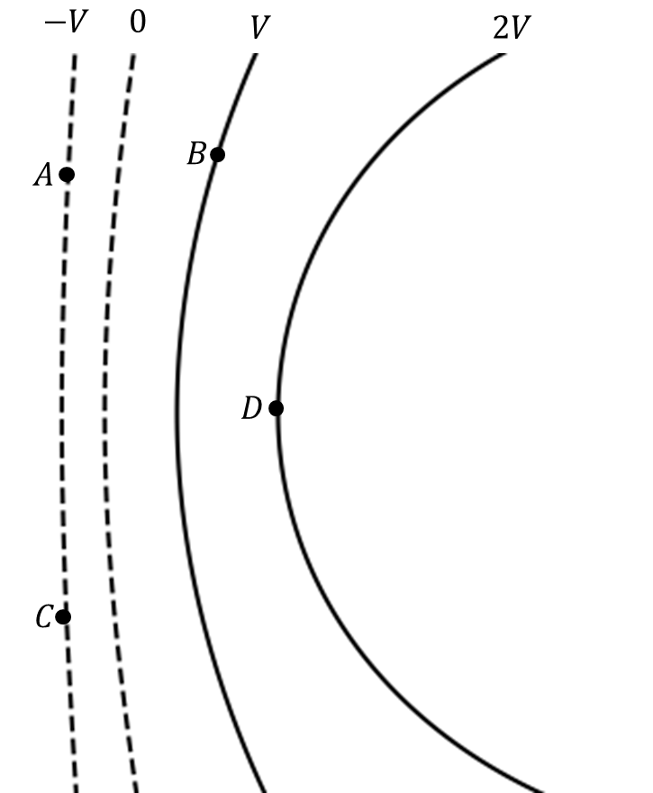

*Suggested Time: 25-30 minutes*

2.) A charge distribution generates the following equipotential curves
shown below. The value of the electric potential on each curve is given,
and each curve is separated by a potential difference $V$.

{width="4.963542213473316in"
height="6.002679352580928in"}

Author: Foster Wisusik
([[fosterwisusik@gmail.com]{.underline}](mailto:fosterwisusik@gmail.com))

a.) A particle of charge $- q$ is placed at Point A. On the diagram
below, **draw** a quantitatively accurate bar chart showing the
magnitude of the work done by the electric field in moving this charge
from Point A to each of the other positions in the diagram. **Label**
the vertical axis of the bar chart. If the work done is zero, write
"zero" over that position.

{width="4.765625546806649in"
height="3.6921052055993in"}

b.) The particle of charge $- q$ has mass $m$. The particle is placed at
Point A and given a velocity $v_{0}$ perpendicular to Point A.
**Derive** an expression for the final velocity $v_{f}$ of the particle
once it reaches Point D. Begin your derivation from a fundamental
physics principle or an equation from the reference sheet.

c.) Suppose the value of $V$ is changed. **Graph** $v_{f}$ as a function
of the equipotential spacing $V$. **Label** any known intercepts and
extrema.

{width="5.286458880139983in"
height="3.3548676727909013in"}

d.) Suppose the setup is replicated, but releasing a particle of mass
$m$ at Point A with *positive charge* $+ q$ with a velocity $v_{0}$
perpendicular to the equipotential curve. **Describe** how this change
will affect the shape and y-intercept of the graph drawn in part (c.).
You may assume the particle reaches Point D.
