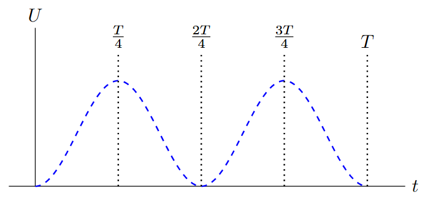

*Suggested Time: 25-30 minutes*

2.) The circuit below consists of a capacitor with capacitance $C$
holding charge $Q_{0}$, an inductor of inductance $L$, and an open
switch. At $t = 0$, the switch is closed for the first time, and the
charge on the capacitor oscillates with a period $T = 2\pi$.

{width="2.9427088801399823in"
height="1.9743405511811023in"}

a.) On the diagram below, **draw** a set of qualitatively accurate bar
charts showing the relative amounts of energy stored in the electric
field of the capacitor ($U_{E}$) and the magnetic field of the inductor
($U_{B}$) at each of the following times:

{width="3.0879647856517933in"
height="2.743698600174978in"}

{width="3.0781255468066493in"
height="2.540585083114611in"}

b.) **Derive** an expression for the magnitude of the potential
difference across the inductor at time $t =$ $\frac{T}{8}$ in terms of
$Q_{0}$, $C$, and $L$.

c.) The dashed curve drawn below shows the approximate potential energy
stored in the inductor as a function of time. On the same set of axes,
**sketch** a graph of the potential energy stored in the capacitor as a
function of time.

{width="6.536387795275591in"
height="3.1285279965004373in"}

d.) Suppose that in the original circuit, the capacitor is isolated
before being given the same initial charge, but an external force
increases the plate separation before the switch is closed for the first
time. **Indicate** [two ways]{.underline} in which this change will
affect the graphs shown in part (c.).
