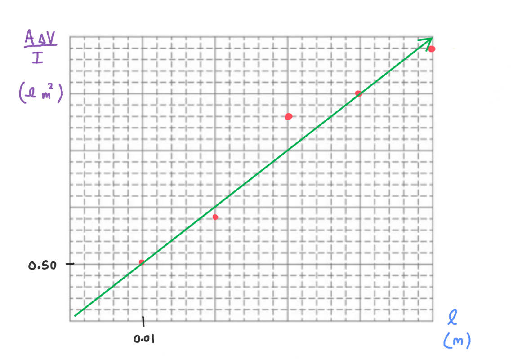

[Scoring Guidelines for Wisusik.EMAG.LAB.003]{.underline}

**Highest Possible Score:** 10 Points

a.) 2 Points

  -----------------------------------------------------------------------
  For indicating the area of each cylinder should be varied, and 1 Point
  the resistance of the cylinder should be measured              
  -------------------------------------------------------------- --------
  For indicating the lengths of each cylinder should be held     1 Point
  constant                                                       

  -----------------------------------------------------------------------

*[Example Solution]{.underline}*

-   *Create several clay cylinders of the same length, but different
    areas*

-   *Determine the resistance of each cylinder using an ohmmeter*

> *\*or by placing the cylinders in a circuit and computing the ratio*
> $\Delta V/I$ *for each cylinder using a voltmeter in parallel and an
> ammeter in series\**

-   *Repeat for a variety of cylinders with different areas\
    *

b.) 2 Points

  -----------------------------------------------------------------------
  For performing a valid attempt at a linearization or power     1 Point
  regression                                                     
  -------------------------------------------------------------- --------
  For a valid interpretation on how to verify/refute the         1 Point
  relationship                                                   

  -----------------------------------------------------------------------

*[Example Solution 1]{.underline}*

-   *Graph the resistance of each cylinder as a function of*
    $\frac{1}{(Area)^{2}}$

-   *If the relationship is approximately linear, then the claim is
    true*

*[Example Solution 2]{.underline}*

-   *Perform a power regression on the data set of*
    $Resistance\ vs\ Area$

-   *If the regression exponent is approximately* $- 2$*, then the claim
    is accurate*

c.) 4 Points

i.) 1 Point

+--------------------------------------------------------------+-------+
| For a correct choice of quantities that could be graphed to  | 1     |
| yield a straight line                                        | Point |
|                                                              |       |
| with the same functional dependence as $R\ vs$ $l$           |       |
+==============================================================+=======+
+--------------------------------------------------------------+-------+

*[Example Solution]{.underline}*

$R =$ $\frac{\rho l}{A}$

$\lbrack RA\rbrack = \rho\lbrack l\rbrack$

Since $\Delta V = IR,\ $ $R =$ $\frac{\Delta V}{I}$

Compute $R =$ $\frac{\Delta V}{I}$, then graph
$\lbrack RA\rbrack\ vs\ \lbrack l\rbrack$

ii.) 3 Points

  -----------------------------------------------------------------------
  For using a set of properly labeled axes (with a scale +       1 Point
  units), and using at least half of the available grid space    
  -------------------------------------------------------------- --------
  For correctly transforming and plotting the data using the     1 Point
  quantities indicated in part (i.)                              

  For drawing a best fit line that approximates the data         1 Point
  -----------------------------------------------------------------------

*[Example Solution]{.underline}*

{width="7.58402012248469in"
height="5.358032589676291in"}

d.) 2 Points

+--------------------------------------------------------------+-------+
| For correctly relating the slope of the line to the          | 1     |
| resistivity of the sports drink                              | Point |
+==============================================================+=======+
| For a final answer consistent with the slope of the line     | 1     |
| graphed and identified relationship                          | Point |
|                                                              |       |
| (Correct Final Answer: $\rho \approx \ 50\ \Omega \cdot m$)  |       |
+--------------------------------------------------------------+-------+

*[Example Solution]{.underline}*

$\lbrack RA\rbrack$ $= (\rho)\ \lbrack l\rbrack$

Linear Regression: $y = (48.7)x + (0.06)$

$Slope = \rho$

$\rho = \ 48.7\ \ \Omega \cdot m$
