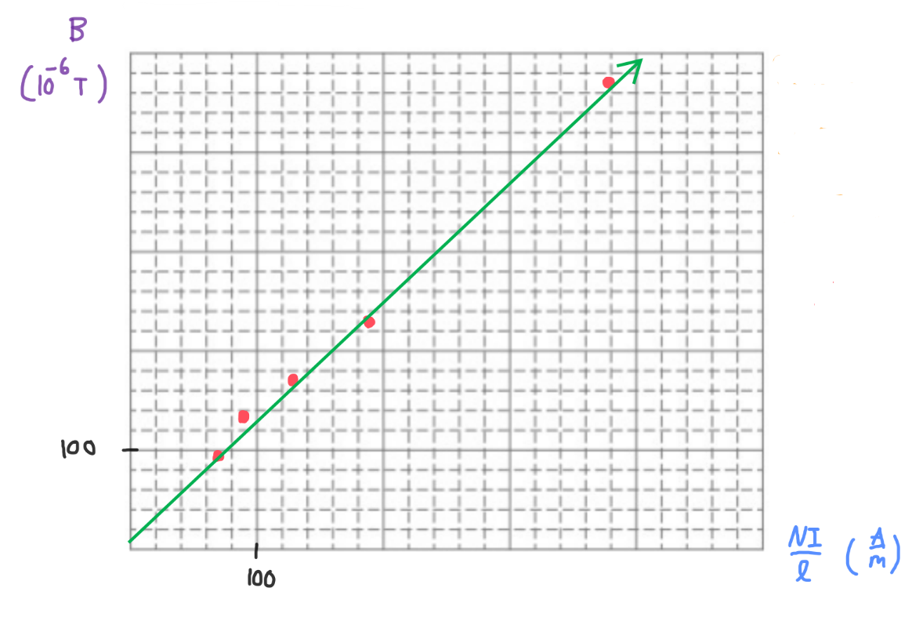

[Scoring Guidelines for Wisusik.EMAG.LAB.007]{.underline}

**Highest Possible Score:** 10 Points

a.) 2 Points

  -----------------------------------------------------------------------
  For indicating that the distance between the wires should be   1 Point
  varied                                                         
  -------------------------------------------------------------- --------
  For a valid method of determining the magnitude of the         1 Point
  magnetic force                                                 

  -----------------------------------------------------------------------

*[Example Solution]{.underline}*

-   *Place the bottom wire on the scale, and before any current is
    applied through the wires, zero the scale*

-   *Record the distance d between the wires, and the magnetic force F
    which is the reading on the bottom scale*

-   *Repeat for various values of the distance* $d$*, recording the
    magnetic force each time*

b.) 2 Points

  -----------------------------------------------------------------------
  For a valid graph utilizing the expression for the magnetic    1 Point
  force between the two wires, $F =$                             
  $\frac{\mu_{0}I^{2}}{2\pi d}$                                  
  -------------------------------------------------------------- --------
  For a valid method of determining the current in the wire from 1 Point
  the graph                                                      

  -----------------------------------------------------------------------

*[Example Solution]{.underline}*

-   $F =$ $\frac{\mu_{0}I^{2}}{2\pi d}$

-   *Graph F as a function of* $\frac{\mu_{0}}{2\pi d}$

-   *Since the slope will be equal to* $I^{2}$*,* $I =$

c.) 4 Points

i.) 1 Point

+--------------------------------------------------------------+-------+
| For a correct choice of quantities that could be graphed to  | 1     |
| yield a straight line                                        | Point |
|                                                              |       |
| with the same functional dependence as                       |       |
| $B\ \ \ vs\ \ \ \ $$\frac{1}{l}$                             |       |
+==============================================================+=======+
+--------------------------------------------------------------+-------+

*[Example Solution]{.underline}*

$B_{Sol} = \mu_{0}\ n\ I$

$B_{Sol} =$ $\frac{\mu_{0}NI}{l}$

$\lbrack B\rbrack = \ (\mu_{0})$ $\lbrack\frac{NI}{l}\rbrack$

ii.) 3 Points

  -----------------------------------------------------------------------
  For using a set of properly labeled axes (with a scale +       1 Point
  units), and using at least half of the available grid space    
  -------------------------------------------------------------- --------
  For correctly transforming and plotting the data using the     1 Point
  quantities indicated in part (i.)                              

  For drawing a best fit line that approximates the data         1 Point
  -----------------------------------------------------------------------

*[Example Solution]{.underline}*

{width="7.764293525809274in"
height="5.337951662292213in"}

d.) 2 Points

+--------------------------------------------------------------+-------+
| For correctly relating the slope of the line to the          | 1     |
| permeability of free space                                   | Point |
+==============================================================+=======+
| For a final answer consistent with the slope of the line     | 1     |
| graphed and identified relationship                          | Point |
|                                                              |       |
| (Correct Final Answer: $\mu_{0} \approx 10^{- 6}\ Tm/A$)     |       |
+--------------------------------------------------------------+-------+

*[Example Solution]{.underline}*

$\lbrack B\rbrack = \ (\mu_{0\ })$ $\lbrack\frac{NI}{l}\rbrack$

$y = (1.18 \times 10^{- 6})x + (1.36 \times 10^{- 5})$

$Slope = \ \mu_{0}$

$\mu_{0} = 1.18 \times 10^{- 6}\ \ Tm/A$
