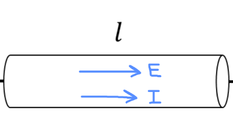

[Scoring Guidelines for Wisusik.EMAG.MR.001]{.underline}

**Highest Possible Score:** 10 Points

a.) 7 Points

i.) 2 Points

  -----------------------------------------------------------------------
  For a labeled electric field arrow pointing to the right       1 Point
  inside the cylinder                                            
  -------------------------------------------------------------- --------
  For a set of labeled current and electric field arrows         1 Point
  pointing in the same direction                                 

  -----------------------------------------------------------------------

*[Example Solution]{.underline}*

> {width="5.026042213473316in"
> height="2.756573709536308in"}

ii.) 3 Points

  ------------------------------------------------------------------------
  For a multistep derivation beginning with                       1 Point
  $I =$$\int_{}^{}\overrightarrow{J} \cdot d\overrightarrow{A}$   
  --------------------------------------------------------------- --------
  For indicating that $dA = 2\pi r\ dr$                           1 Point

  For a correct final answer, $I = \pi ad$                        1 Point
  ------------------------------------------------------------------------

*[Example Solution]{.underline}*

$I = \ $$\int_{}^{}\overrightarrow{J} \cdot d\overrightarrow{A}$

$=$$\ \int_{}^{}J(r)dA$

$=$$\ \int_{}^{}J(r)(2\pi rdr)$

$=$$\ \int_{}^{}ar^{- 1}(2\pi rdr)$

$=$$\ 2\pi a\int_{0}^{d/2}dr$

$=$$\ 2\pi a$ $(\frac{d}{2})$

$I = \ \pi ad$

iii.) 2 Points

  -----------------------------------------------------------------------
  For indicating that the total current in the cylinder          1 Point
  decreases                                                      
  -------------------------------------------------------------- --------
  For a valid justification                                      1 Point

  -----------------------------------------------------------------------

*[Example Solution]{.underline}*

*If the temperature of the cylinder increases, then the current will
decrease.*

*Resistance increases with temperature (since there is a higher
frequency of collisions), meaning there will be less current flow for
the same potential difference.*

b.) 3 Points

+--------------------------------------------------------------+-------+
| For a multistep derivation involving Ohm's Law,              | 1     |
| $\Delta V = IR$                                              | Point |
+==============================================================+=======+
| For indicating $R = \int_{}^{}$ $\frac{\rho(x)dx}{A}$        | 1     |
|                                                              | Point |
+--------------------------------------------------------------+-------+
| For a correct final expression equivalent to                 | 1     |
| $\varepsilon = I_{Tot}\ \ \int_{0}^{l}$                      | Point |
| $\frac{(b + 1)x\ dx}{\pi\ (\frac{d}{2})^{2}}$                |       |
|                                                              |       |
| \*Scoring Note\*                                             |       |
|                                                              |       |
| It is not necessary to expand $\rho(x)$ into $b(x + 1)$ to   |       |
| earn this point                                              |       |
+--------------------------------------------------------------+-------+

*[Example Solution]{.underline}*

$\Delta V = IR$

$\varepsilon$ $= I_{Tot}$ $(\int_{}^{}\frac{\rho(x)dx}{A})$

$= I_{Tot}$ $(\int_{0}^{l}\frac{\rho(x)dx}{\pi(\frac{d}{2})^{2}})$

$\varepsilon$ $= I_{Tot}$
$\int_{0}^{l}\frac{b(x + 1)dx}{\pi(\frac{d}{2})^{2}}$
