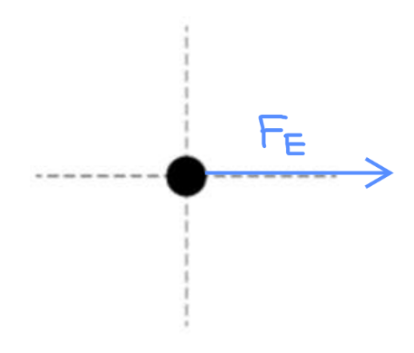

[Scoring Guidelines for Wisusik.EMAG.MR.002]{.underline}

**Highest Possible Score:** 10 Points

a.) 7 Points

i.) 3 Points

*Solution 1*

  -----------------------------------------------------------------------
  For a statement of Ohm's Law in microscopic form,              1 Point
  $(E = \rho J)$                                                 
  -------------------------------------------------------------- --------
  For a correct relationship involving current and current       1 Point
  density, $J =$ $\frac{I}{s^{2}}$                               

  For a correct final answer, $\rho =$ $\frac{Es^{2}}{I}$        1 Point
  -----------------------------------------------------------------------

*[Example Solution 1]{.underline}*

$E = \rho J$

$E = \rho$ $(\frac{I}{A})$

$E = \rho$ $\frac{I}{s^{2}}$

$\rho =$ $\frac{Es^{2}}{I}$

*Solution 2*

  -----------------------------------------------------------------------
  For a statement of Ohm's Law in macroscopic form,              1 Point
  $(\Delta V = IR)$                                              
  -------------------------------------------------------------- --------
  For stating $\Delta V = E\Delta x\ $ *and* $R =$               1 Point
  $\frac{\rho\Delta x}{A}$                                       

  For a correct final answer, $\rho =$ $\frac{Es^{2}}{I}$        1 Point
  -----------------------------------------------------------------------

*[Example Solution 2]{.underline}*

$\Delta V = IR$

$(E\Delta x) = I$ $(\frac{\rho\Delta x}{A})$

$E = I$ $\frac{\rho}{s^{2}}$

$\rho =$ $\frac{Es^{2}}{I}$

ii.) 2 Points

  -----------------------------------------------------------------------
  For drawing a singular electric force, with no extraneous      1 Point
  force vectors                                                  
  -------------------------------------------------------------- --------
  For drawing a labeled electric force pointing directly left    1 Point

  -----------------------------------------------------------------------

*[Example Solution]{.underline}*

{width="4.140625546806649in"
height="3.527199256342957in"}

iii.) 2 Points

  -----------------------------------------------------------------------
  For using the relationship $I = nevA$                          1 Point
  -------------------------------------------------------------- --------
  For a correct final answer $v =$ $\frac{I\Delta x}{Ne}$        1 Point

  -----------------------------------------------------------------------

*[Example Solution]{.underline}*

$I = nqvA$

$I =$ $(\frac{N}{V})$$(e)vA$

$I =$ $(\frac{N}{A\Delta x})$$evA$

$v =$ $(\frac{I\Delta x}{Ne})$

b.) 3 Points

  -----------------------------------------------------------------------
  For indicating $|\Delta V| = E\Delta x$                        1 Point
  -------------------------------------------------------------- --------
  For indicating that the right side of the slab is at a higher  1 Point
  potential                                                      

  For a valid justification                                      1 Point
  -----------------------------------------------------------------------

*[\
]{.underline}*

*[Example Solution]{.underline}*

$|\Delta V| = E\Delta x$*, and the right side of the slab is at higher
potential. The electric field always points*

*towards regions of lower electric potential, so the leftward pointing
electric field indicates that*

*the left side of the slab must be at a lower potential than the right
side.*
