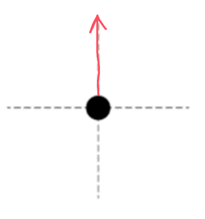

[Scoring Guidelines for Wisusik.EMAG.MR.003]{.underline}

**Highest Possible Score:** 10 Points

a.) 7 Points

i.) 2 Points

  -----------------------------------------------------------------------
  For no horizontal forces                                       1 Point
  -------------------------------------------------------------- --------
  For a net force directed upwards                               1 Point

  -----------------------------------------------------------------------

*[Example Solution]{.underline}*

{width="3.1718755468066493in"
height="3.392866360454943in"}

ii.) 2 Points

*\*Scoring Note\**

*Full credit can be earned for this part even if incorrect signs are
present*

  -----------------------------------------------------------------------
  For relating the work required to the potential energy of the  1 Point
  system: $W_{Ext} = U$                                          
  -------------------------------------------------------------- --------
  For a correct computation of $U =$ $\frac{3kq^{2}}{s}$         1 Point

  -----------------------------------------------------------------------

*[Example Solution]{.underline}*

$W_{Ext} = U_{System}$

$U$ $= \sum_{}^{}$ $\frac{kq^{2}}{r}$

$U$ $=$ $\frac{3kq}{s^{2}}$

iii.) 3 Points

  -----------------------------------------------------------------------
  For a multistep derivation starting from Coulomb's Law,        1 Point
  $F = \sum_{}^{}$ $\frac{kQq}{r^{2}}$ $\widehat{r}$             
  -------------------------------------------------------------- --------
  For an attempt to recover only the vertical component of the   1 Point
  electric force                                                 

  For a correct final answer, $F = \ $$\frac{\ kq^{2}}{s^{2}}$   1 Point
  -----------------------------------------------------------------------

*[Example Solution]{.underline}*

$\overrightarrow{F} = \sum_{}^{}$ $\frac{kq}{r^{2}}$ $\widehat{r}$

${|\overrightarrow{F}}_{Net}| = 2 \cdot F_{y}$

$= \ 2 \cdot F_{E}\sin(60{^\circ})$

$=$ $\frac{2kq^{2}}{s^{2}}$ $\cdot$ $\frac{}{2}$

${|\overrightarrow{F}}_{Net}| =$ $\frac{\ kq^{2}}{s^{2}}$

b.) 3 Points

+--------------------------------------------------------------+-------+
| For a multistep derivation involving conservation of energy  | 1     |
|                                                              | Point |
+==============================================================+=======+
| For indicating $\Delta U = \ $$\frac{- 2kq^{2}}{s}$          | 1     |
|                                                              | Point |
+--------------------------------------------------------------+-------+
| For a final answer consistent with $\Delta U$ (equivalent to | 1     |
| $v =$ $$ if done correctly)                                  | Point |
|                                                              |       |
| *\*Scoring Note\**                                           |       |
|                                                              |       |
| *This point can still be earned for an incorrect*            |       |
| $\Delta U$*, as long as the algebra is correct*              |       |
+--------------------------------------------------------------+-------+

*[Example Solution]{.underline}*

$K_{0} + U_{0} = K_{f} + U_{f}$

$0 +$ $\frac{3kq^{2}}{s}$ $=$
$\frac{1}{2}mv^{2}\  + \ $$\frac{1kq^{2}}{s}$

$\frac{4kq^{2}}{s}$ $=$ $mv^{2}$

$v =$ $$ or $v =$ $$
