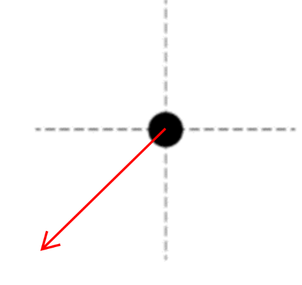

[Scoring Guidelines for Wisusik.EMAG.MR.004]{.underline}

**Highest Possible Score:** 10 Points

a.) 7 Points

i.) 2 Points

  -----------------------------------------------------------------------
  For a correct equation for electric potential,                 1 Point
  $V = \sum_{}^{}$ $\frac{kq}{r}$                                
  -------------------------------------------------------------- --------
  For a correct answer (including sign), $V =$                   1 Point
  $\frac{- 8\ kq}{R}$                                            

  -----------------------------------------------------------------------

*[Example Solution]{.underline}*

$V = \sum_{}^{}$ $\frac{kq}{r}$

$V = 2$ $\frac{k( + q)}{R}$ $+ \ 10$ $\frac{k( - q)}{R}$

$V =$ $\frac{- 8\ kq}{R}$ or $V =$ $\frac{- 2\ q}{\pi\varepsilon_{0}R}$

ii.) 2 Points

  -----------------------------------------------------------------------
  For an electric field component pointing to the left           1 Point
  -------------------------------------------------------------- --------
  For an electric field component pointing down                  1 Point

  -----------------------------------------------------------------------

*[Example Solution]{.underline}*

> {width="3.1927088801399823in"
> height="2.994812992125984in"}

iii.) 3 Points

  -----------------------------------------------------------------------
  For a derivation starting from the expression for electric     1 Point
  field, $E = \sum_{}^{}$ $\frac{kq}{r^{2}}$ $\widehat{r}$       
  -------------------------------------------------------------- --------
  For using the pythagorean theorem to find the magnitude of the 1 Point
  resultant                                                      

  For a correct final answer, $E = \ $$\frac{2kq}{R^{2}}$        1 Point
  -----------------------------------------------------------------------

*[Example Solution]{.underline}*

$E = \sum_{}^{}$ $\frac{kq}{r^{2}}$ $\widehat{r}$

$E =$ $\frac{2kq}{R^{2}}$ $( - \widehat{i})\  +$
$\frac{2kq}{R^{2}}$$( - \widehat{j})$

$|E| = \ $

$|E| =$ $\frac{2kq}{R^{2}}$ or $|E| =$
$\frac{q}{2\pi\varepsilon_{0}R^{2}}$

b.) 3 Points

+--------------------------------------------------------------+-------+
| For a multistep derivation involving conservation of energy  | 1     |
|                                                              | Point |
+==============================================================+=======+
| For indicating $\Delta U = \ $$\frac{- kq^{2}}{R}$           | 1     |
|                                                              | Point |
+--------------------------------------------------------------+-------+
| For a final answer consistent with $\Delta U$ and involves   | 1     |
| accounting for the kinetic energy of both masses (equivalent | Point |
| to $v =$ $$ if done correctly)                               |       |
|                                                              |       |
| *\*Scoring Note\**                                           |       |
|                                                              |       |
| *This point can still be earned for an incorrect*            |       |
| $\Delta U$*, as long as the algebra is correct*              |       |
+--------------------------------------------------------------+-------+

*[Example Solution]{.underline}*

$K_{0} + U_{0} = K_{f} + U_{f}$

$0 +$ $\frac{kq^{2}}{R}$ $=$ $2*(\frac{1}{2}mv^{2})\  + \ 0$

$\frac{kq^{2}}{R}$ $=$ $mv^{2}$

$v =$ $$ or $v =$ $$
