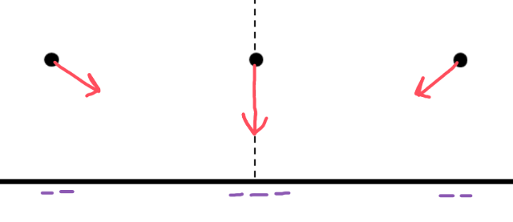

[Scoring Guidelines for Wisusik.EMAG.MR.006]{.underline}

**Highest Possible Score:** 10 Points

a.) 7 Points

i.) 2 Points

  -----------------------------------------------------------------------
  For drawing an electric field vector that points directly      1 Point
  downward at $x = 0$                                            
  -------------------------------------------------------------- --------
  For drawing electric field vectors at the other two points     1 Point
  that are directed towards the midpoint of the rod              

  -----------------------------------------------------------------------

*[Example Solution]{.underline}*

{width="6.5in"
height="2.8194444444444446in"}

ii.) 1 Points

*\*Scoring Note\**

*A negative sign is not required to earn this point*

  -----------------------------------------------------------------------
  For a correct answer, $Q = \int_{- L}^{L}\lambda(x)dx$ or      1 Point
  $Q = \  - \int_{- L}^{L}e^{- x^{2}}dx$                         
  -------------------------------------------------------------- --------

  -----------------------------------------------------------------------

*[Example Solution]{.underline}*

$Q = \int_{}^{}dq$

$= \int_{}^{}\lambda(x)dx$

$Q = \  - \int_{- L}^{L}e^{- x^{2}}dx$

iii.) 4 Points

  -----------------------------------------------------------------------
  For a multistep derivation beginning with the electric field   1 Point
  from a continuous charge distribution: $E = \int_{}^{}$        
  $\frac{k\ dq}{r^{2}}$ $\widehat{r}$                            
  -------------------------------------------------------------- --------
  For identifying $dq = \lambda(x)dx$                            1 Point

  For successfully recovering the y-component of the electric    1 Point
  field                                                          

  For a correct final answer equivalent to                       1 Point
  $E = ka\ \int_{- L}^{L}$                                       
  $\frac{\lambda(x)\ dx}{(x^{2} + a^{2})^{3/2}}$                 
  -----------------------------------------------------------------------

*[Example Solution]{.underline}*

$E = \int_{}^{}$ $\frac{k\ dq}{r^{2}}$ $\widehat{r}$

$|E| = E_{y} =$ $\int_{}^{}\frac{k\ (\ \lambda(x)\ dx)}{r^{2}}$
$\cos\theta$

$=$ $\int_{}^{}\frac{k\ \ \lambda(x)\ dx}{(x^{2} + a^{2})}$
$\cdot \frac{a}{}$

$E = ka\ \int_{- L}^{L}$ $\frac{\lambda(x)\ dx}{(x^{2} + a^{2})^{3/2}}$

$E = ka\ \int_{- L}^{L}$ $\frac{e^{- x^{2}}\ dx}{(x^{2} + a^{2})^{3/2}}$
or $E =$ $\frac{a}{4\pi\varepsilon_{0}}$ $\int_{- L}^{L}$
$\frac{e^{- x^{2}}\ dx}{(x^{2} + a^{2})^{3/2}}$

b.) 3 Points

+--------------------------------------------------------------+-------+
| For a multistep derivation beginning with the electric       | 1     |
| potential from a continuous charge distribution:             | Point |
| $V = \int_{}^{}$ $\frac{k\ dq}{r}$                           |       |
+==============================================================+=======+
| For indicating $\lambda = \ $$\frac{Q}{2L}$                  | 1     |
|                                                              | Point |
+--------------------------------------------------------------+-------+
| For a final answer equivalent to                             | 1     |
| $V = k\lambda\ \ln(1 + \frac{2L}{b})$                        | Point |
|                                                              |       |
| *\*Scoring Note\**                                           |       |
|                                                              |       |
| *This point can still be earned for an incorrect*            |       |
| $\lambda$*, as long as the algebra is correct*               |       |
+--------------------------------------------------------------+-------+

*[Example Solution]{.underline}*

$V = \int_{}^{}$ $\frac{k\ dq}{r^{2}}$

$\lambda =$ $\frac{Q}{2L}$

$=$ $\int_{}^{}\frac{k\ (\ \lambda\ dx)}{r}$

$= \ k\lambda$ $\int_{b}^{b + 2L}\frac{dx}{x}$

$= k\lambda\ \ln(x){|_{b}}^{b + 2L}$

$V = k\lambda\ \ln(1 + \frac{2L}{b})$ or $V =$
$\frac{\lambda}{4\pi\varepsilon_{0}}$ $\ln(1 + \frac{2L}{b})$

$=$ $\frac{kQ}{2L}$ $\ln(1 + \frac{2L}{b})$ or $=$
$\frac{Q}{8\pi\varepsilon_{0}L}$ $\ln(1 + \frac{2L}{b})$
