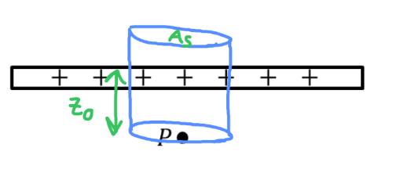

[Scoring Guidelines for Wisusik.EMAG.MR.007]{.underline}

**Highest Possible Score:** 10 Points

a.) 7 Points

i.) 2 Points

  -----------------------------------------------------------------------
  For drawing a Gaussian Surface through *one* of the plates     1 Point
  that exhibits planar symmetry                                  
  -------------------------------------------------------------- --------
  For labeling at least one geometric parameter (length, area)   1 Point
  on the surface                                                 

  -----------------------------------------------------------------------

*[Example Solution]{.underline}*

{width="5.447916666666667in"
height="2.4479166666666665in"}

ii.) 3 Points

  -----------------------------------------------------------------------
  For stating the formula for the electric field due to a plane, 1 Point
  or deriving the result using Gauss's Law: $E =$                
  $\frac{\sigma}{2\varepsilon_{0}}$                              
  -------------------------------------------------------------- --------
  For identifying that the net electric field is equal to two    1 Point
  times the electric field from a single plate                   

  For a correct final answer in terms of the quantities given    1 Point
  $E =$ $\frac{Q}{A\varepsilon_{0}}$                             
  -----------------------------------------------------------------------

*[Example Solution]{.underline}*

$\int_{}^{}E \cdot dA =$ $\frac{Q_{enc}}{\varepsilon_{0}}$

$E(2A) =$ $\frac{(\sigma A)}{\varepsilon_{0}}$

$E_{One\ Plate} =$ $\frac{\sigma}{2\varepsilon_{0}}$

$E_{Both} = 2 \cdot E_{One\ Plate} =$ $\frac{\sigma}{\varepsilon_{0}}$

$E =$ $\frac{Q}{A\varepsilon_{0}}$

iii.) 2 Points

[Solution 1]{.underline}

  -----------------------------------------------------------------------
  For stating the relationships $\Delta U = q\Delta V$ and       1 Point
  $\Delta V = Ed$                                                
  -------------------------------------------------------------- --------
  For a correct answer with sign, $W = qEz_{0}$                  1 Point

  -----------------------------------------------------------------------

*[Example Solution 1]{.underline}*

$W_{Internal} = \  - \Delta U$

$= \  - ( - q)\Delta V$

$= \ q(ED)$

$W = \  + qEz_{0}$

[Solution 2]{.underline}

  -----------------------------------------------------------------------
  For stating the relationships $W = Fd$ and $F = qE$            1 Point
  -------------------------------------------------------------- --------
  For a correct answer with sign, $W = qEz_{0}$                  1 Point

  -----------------------------------------------------------------------

*[Example Solution 2]{.underline}*

$W = FD\cos\theta$

$= \ (qE)(z_{0})\cos(0)$

$= \ qEz_{0}$

$W = \  + qEz_{0}$

b.) 3 Points

  -----------------------------------------------------------------------
  For a multistep derivation beginning with a statement of       1 Point
  Gauss's Law, $\Phi =$ $\frac{Q_{enc}}{\varepsilon_{0}}$        
  -------------------------------------------------------------- --------
  For indicating                                                 1 Point
  $Q_{enc} = \ $$\sigma A_{Top} - \sigma A_{Bottom}$             

  For a final answer equivalent to $\Phi =$                      1 Point
  $\frac{- 16\ \sigma\ \pi\ R^{2}}{\varepsilon_{0}\ }$,          
  including sign                                                 
  -----------------------------------------------------------------------

*[Example Solution]{.underline}*

$\Phi =$ $\frac{Q_{enc}}{\varepsilon_{0}}$

$=$ $\frac{Q_{+} - \ Q_{-}}{\varepsilon_{0}}$

$=$ $\frac{\sigma A_{+} - \ \sigma A_{-}}{\varepsilon_{0}}$

$=$
$\frac{\sigma(\ \pi\ r(z = d)^{2}\  - \ \pi\ r(z = \  - d)^{2}\ )}{\varepsilon_{0}}$

$= \ $$\frac{\sigma\pi(\ \ r(d)^{2}\  - \ r( - d)^{2}\ )}{\varepsilon_{0}}$

$= \ $$\frac{\sigma\pi(\ \ r(d)^{2}\  - \ r( - d)^{2}\ )}{\varepsilon_{0}}$

$= \ $$\frac{\sigma\pi(\ \ (3R)^{2}\  - \ (5R)^{2}\ )}{\varepsilon_{0}}$

$\Phi =$ $\frac{- 16\ \sigma\ \pi\ R^{2}}{\varepsilon_{0}\ }$ or
$\Phi = \  - 64\ \sigma\ {k\pi}^{2}\ R^{2}$
