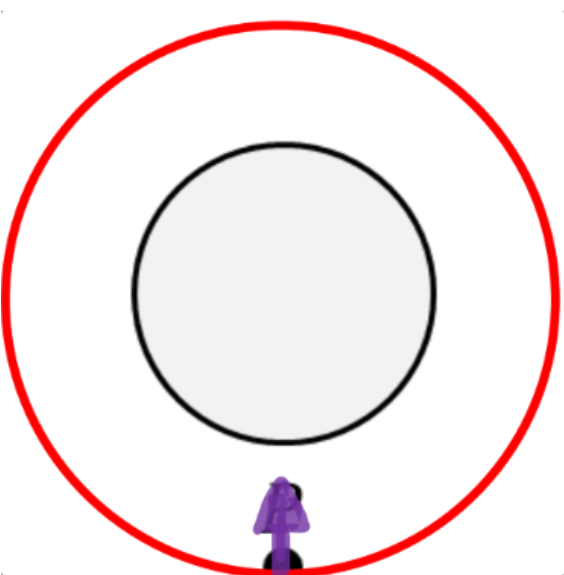

[Scoring Guidelines for Wisusik.EMAG.MR.009]{.underline}

**Highest Possible Score:** 10 Points

a.) 7 Points

i.) 2 Points

  -----------------------------------------------------------------------
  For drawing a circle concentric with the system that contains  1 Point
  Point P                                                        
  -------------------------------------------------------------- --------
  For drawing an electric field pointing directly upwards at     1 Point
  Point P                                                        

  -----------------------------------------------------------------------

*[Example Solution]{.underline}*

{width="3.398973097112861in"
height="3.461094706911636in"}

ii.) 5 Points

+--------------------------------------------------------------+-------+
| For a correct expression for the electric field inside the   | 1     |
| captivity, $E =$ $\frac{(Q/L)}{2\pi\varepsilon_{0}r}$        | Point |
+==============================================================+=======+
| For a correct expression for potential difference between    | 1     |
| the two cylinders, $\Delta V = \  - \int_{R}^{3R}$           | Point |
| $E \cdot dr$                                                 |       |
|                                                              |       |
| \*Scoring Note\*                                             |       |
|                                                              |       |
| The negative sign is not required to earn this point         |       |
+--------------------------------------------------------------+-------+
| For an expression for the magnitude of the potential         | 1     |
| difference consistent with the expression of $E$             | Point |
|                                                              |       |
| Correct answer: $\Delta V =$                                 |       |
| $\frac{Q\ \ln(3)}{2\pi\varepsilon_{0}l}$                     |       |
+--------------------------------------------------------------+-------+
| For a correct expression for capacitance, $C =$              | 1     |
| $\frac{Q}{|\Delta V|}$                                       | Point |
+--------------------------------------------------------------+-------+
| For a consistent final answer with no dependence on $Q$      | 1     |
|                                                              | Point |
| Correct answer: $C =$ $\frac{2\pi\varepsilon_{0}l}{\ln(3)}$  |       |
+--------------------------------------------------------------+-------+

*[Example Solution]{.underline}*

$\int_{}^{}E \cdot dA =$ $\frac{Q_{enc}}{\varepsilon_{0}}$

$E(2\pi rl) =$ $\frac{(Q)}{\varepsilon_{0}}$

$E =$ $\frac{(Q/l)}{2\pi\varepsilon_{0}r}$

$\Delta V = \  - \ \int_{R}^{3R}E \cdot dr$

$= \  - \int_{R}^{3R}$$\frac{Q}{2\pi\varepsilon_{0}l\ r}$ $dr$

$=$ $\frac{- Q}{2\pi\varepsilon_{0}l\ }$ $\ \int_{R}^{3R}$$\frac{dr}{r}$

$=$ $\frac{- Q}{2\pi\varepsilon_{0}l\ }$ $\ \ln(r){|_{R}}^{3R}$$$

$\frac{- Q}{2\pi\varepsilon_{0}l\ }$ $\ \ln(3)$

$C =$ $\frac{Q}{|\Delta V|}$

$C =$ $\frac{Q}{\frac{Q}{2\pi\varepsilon_{0}l\ }\ \ \ln(3)\ \ }$

$C =$ $\frac{2\pi\varepsilon_{0}\ l}{\ln(3)\ \ }$

b.) 3 Points

i.) 1 Points

  -----------------------------------------------------------------------
  For a correct loop equation equivalent to $\frac{q}{C}$        1 Point
  $+$$\ \frac{r}{3}$ $\frac{dq}{dt}$ $= 0$                       
  -------------------------------------------------------------- --------

  -----------------------------------------------------------------------

*[Example Solution]{.underline}*

$\sum_{}^{}\Delta V = 0$

$\Delta V_{C} + \Delta V_{R} = 0$

$\frac{q}{C}$ $-$ $IR_{eq} = 0$

$\frac{q}{C}$ $-$$\ \frac{r}{3}$ $( - \frac{dq}{dt})$ $= 0$

$\frac{q}{C}$ $+$$\ \frac{r}{3}$ $\frac{dq}{dt}$ $= 0$

ii.) 2 Points

  -----------------------------------------------------------------------
  For correctly identifying that the charge decreases            1 Point
  exponentially with time, and takes the form                    
  $q(t) = q{\ e}^{- t/\tau}$                                     
  -------------------------------------------------------------- --------
  For a correct answer equivalent to $t = \tau\ln(2)$            1 Point

  -----------------------------------------------------------------------

*[Example Solution]{.underline}*

$\frac{dq}{dt}$ $=$ $\frac{- q}{(rC/3)}$

$q(t) = q{{\ _{0}e}^{- t/(rC/3)}}_{}$

$\frac{1}{2}{\ q}_{0} = q{{\ _{0}e}^{- t/(rC/3)}}_{}$

$\frac{1}{2} = {e^{- t/(rC/3)}}_{}$

$\ln(\frac{1}{2}) =$ $\frac{- t}{(rC/3)}$

$t =$ $\frac{- rC}{3}$ $\ln(\frac{1}{2})$

$t =$ $\frac{rC}{3}$ $\ln(2)$
