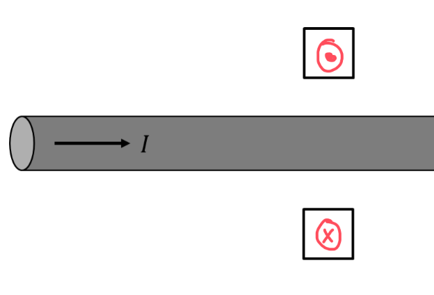

[Scoring Guidelines for Wisusik.EMAG.MR.010]{.underline}

**Highest Possible Score:** 10 Points

a.) 7 Points

i.) 2 Points

  -----------------------------------------------------------------------
  For drawing a magnetic field that is purely into/out of the    1 Point
  page at both locations                                         
  -------------------------------------------------------------- --------
  For drawing a magnetic field out of the page in the top box,   1 Point
  and into the page in the bottom box                            

  -----------------------------------------------------------------------

*[Example Solution]{.underline}*

{width="5.244792213473316in"
height="3.5637685914260717in"}

ii.) 5 Points

  -----------------------------------------------------------------------
  For a multistep derivation beginning with Ampere's Law,        1 Point
  $\int_{}^{}B \cdot dl = \mu_{0}I_{enc}$                        
  -------------------------------------------------------------- --------
  For evaluating the left hand side of Ampere's Law using a      1 Point
  circular loop of radius r, which would yield                   
  $\int_{}^{}B \cdot dl = B(2\pi r)$                             

  For attempting to find the enclosed current by integrating the 1 Point
  current density via the relationship                           
  $I = \int_{}^{}J \cdot dA$                                     

  For a correct expression of the enclosed current,              1 Point
  $I_{enc} = \frac{4}{5}\pi cr^{2}$                              

  For an expression for $B$ consistent with $I_{enc}$ (correct   1 Point
  answer: $B =$ $\frac{2}{5}{\ \mu}_{0}c{\ r}^{3/2}$)            
  -----------------------------------------------------------------------

*[Example Solution]{.underline}*

$\int_{}^{}B \cdot dl = \mu_{0}I_{enc}$

$B(2\pi r) = \mu_{0}I_{enc}$

$I_{enc} = \int_{}^{}J \cdot dA$

$= \int_{0}^{r}J(r)(2\pi r\ dr)$

$= \int_{0}^{r}(cr^{1/2})(2\pi r\ dr)$

$= 2\pi c\int_{0}^{r}(r^{3/2}\ dr)$

$= 2\pi c \cdot (\frac{2}{5}r^{5/2})$

$I_{enc} = \frac{4}{5}\pi cr^{5/2}$

$B(2\pi r) = \mu_{0}(\frac{4}{5}\pi cr^{5/2})$

$B =$ $\frac{2}{5}{\ \mu}_{0}c{\ r}^{3/2}$

b.) 3 Points

  -----------------------------------------------------------------------
  For a correct expression for magnetic flux,                    1 Point
  $\Phi = \int_{}^{}B \cdot dA$                                  
  -------------------------------------------------------------- --------
  For a correct expression for the magnetic field from the wire, 1 Point
  $B =$ $\frac{\mu_{0}I}{2\pi r}$                                

  For a correct final answer equivalent to $\Phi =$              1 Point
  $\frac{\mu_{0}\ I\ s}{2\pi}$ $\ln 2$                           
  -----------------------------------------------------------------------

*[Example Solution]{.underline}*

$\Phi = \int_{}^{}B \cdot dA$

$B = B_{Wire} =$ $\frac{\mu_{0}I}{2\pi r}$

$\Phi = \int_{s}^{2s}$$\frac{\mu_{0}I}{2\pi y}$ $(s\ dy)$

$= \ $$\frac{\mu_{0}I\ s}{2\pi}$ $(\ln y){|_{s}}^{2s}$

$\Phi = \ $$\frac{\mu_{0}I\ s}{2\pi}$ $\ln 2$
