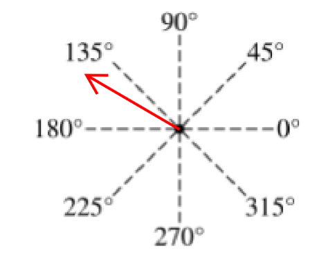

[Scoring Guidelines for Wisusik.EMAG.QQT.005]{.underline}

**Highest Possible Score:** 8 Points

a.) 3 Points

  -----------------------------------------------------------------------
  For drawing an arrow between 135° and 180°                     1 Point
  -------------------------------------------------------------- --------
  For indicating that the net electric field is the vector sum   1 Point
  of the field from each individual point charge                 

  For indicating that the $2q$ charge produces a field of        1 Point
  greater magnitude                                              
  -----------------------------------------------------------------------

*[Example Solution]{.underline}*

-   *The net electric field will be the sum of the electric field from
    each charge*

-   *The -q charge produces a field directly upwards, and the 2q
    produces a field pointing directly to the left*

-   *Since the distance from each charge is the same, the field pointing
    to the left will be larger*

-   *Thus, the net electric field field point up and to the left, with a
    larger leftward component than upward
    component*{width="3.213542213473316in"
    height="2.8374890638670167in"}

b.) 3 Points

+--------------------------------------------------------------+-------+
| For a derivation using the expression for the electric field | 1     |
| of a point charge,                                           | Point |
|                                                              |       |
| $\overrightarrow{E} = \sum_{}^{}$ $\frac{kQ}{r^{2}}$         |       |
| $\widehat{r}$                                                |       |
+==============================================================+=======+
| For indicating that the electric fields must be added as     | 1     |
| vectors, and the magnitude of the electric field must be     | Point |
| found using the Pythagorean Theorem                          |       |
+--------------------------------------------------------------+-------+
| For a correct final answer equivalent to $|E| =$             | 1     |
| $\frac{kq}{a^{2}}$                                           | Point |
+--------------------------------------------------------------+-------+

*[Example Solution]{.underline}*

$\overrightarrow{E} = \sum_{}^{}$ $\frac{kQ}{r^{2}}$ $\widehat{r}$

$=$ $\frac{k(2q)}{a^{2}}$ $( - \widehat{i}) +$$\ \frac{kq}{a^{2}}$
$\widehat{j}$

$|E| =$

$|E| =$$\ $

$|E| =$ $\frac{kq}{a^{2}}$

c.) 2 Points

  -----------------------------------------------------------------------
  For indicating the ratio $\frac{|E_{x}|}{|E_{y}|}$ $= 1$       1 Point
  -------------------------------------------------------------- --------
  For a valid justification                                      1 Point

  -----------------------------------------------------------------------

*[Example Solution]{.underline}*

-   *The net effect of adding the 3q charge can be reduced to a two
    charge setup with a charge of 1q placed at x= -a, and a charge -q
    placed at y=a*

-   *These two charges produce fields of equal magnitude: one pointing
    right, and the other pointing up*

-   *Thus, the horizontal and vertical components of the net electric
    field are equal in magnitude*
