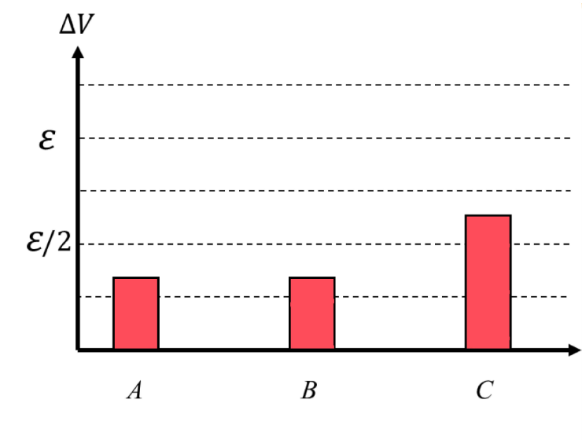
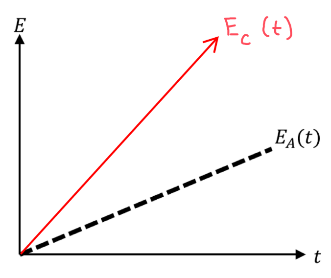

[Scoring Guidelines for Wisusik.EMAG.TBR.001]{.underline}

**Highest Possible Score:** 12 Points

a.) 3 Points

  -----------------------------------------------------------------------
  For indicating $\Delta V_{C}$ is greater than $\Delta V_{A}$   1 Point
  and $\Delta V_{B}$                                             
  -------------------------------------------------------------- --------
  For indicating $\Delta V_{A} = \Delta V_{B}$                   1 Point

  For indicating $\Delta V_{A} + \Delta V_{C} =$ $\varepsilon$   1 Point
  and $\Delta V_{B} + \Delta V_{C} =$ $\varepsilon$              
  -----------------------------------------------------------------------

*[Example Solution]{.underline}*

{width="5.611259842519685in"
height="4.244413823272091in"}

b.) 4 Points

+--------------------------------------------------------------+-------+
| For correctly computing $R_{eq} = \frac{3}{2}R$              | 1     |
|                                                              | Point |
+==============================================================+=======+
| For correctly computing the total current in the circuit     | 1     |
| $I_{Tot} =$ $\frac{\varepsilon}{R_{eq}}$                     | Point |
+--------------------------------------------------------------+-------+
| For correctly computing the current through *or* potential   | 1     |
| difference across Bulb $A$, equivalent to $\Delta V_{A} =$   | Point |
| $\frac{1}{3}\ \varepsilon$ or $I_{A} =$                      |       |
| $\frac{\varepsilon}{3R}$                                     |       |
+--------------------------------------------------------------+-------+
| For a consistent substitution into an expression for power   | 1     |
| equivalent to $P = I\Delta V$                                | Point |
|                                                              |       |
| Correct Final Answer: $P =$ $\frac{\varepsilon^{2}}{9R}$     |       |
+--------------------------------------------------------------+-------+

*[Example Solution]{.underline}*

$P_{A} = I_{A}\ \Delta V_{A}$

$R_{eq} = R + ($$\frac{1}{R}$ $+$ $\frac{1}{R}$$)^{- 1}$

$R_{eq} =$ $\frac{3}{2}\ R$

$I_{Tot} =$ $\frac{\varepsilon}{R_{eq}}$ $=$ $\frac{2\varepsilon}{3R}$

$I_{A} = \frac{1}{2}{\ I}_{Tot} =$ $\frac{\varepsilon}{3R}$

$P = I\Delta V = I^{2}R =$ $(\frac{\varepsilon}{3R})^{2}$ $R$

$P_{A} =$ $\frac{\varepsilon^{2}}{9R}$

c.) 3 Points

  -----------------------------------------------------------------------
  For a graph that is strictly increasing                        1 Point
  -------------------------------------------------------------- --------
  For a linear graph that passes through the origin              1 Point

  For a graph that is always greater than $E_{A}(t)$ for $t > 0$ 1 Point
  -----------------------------------------------------------------------

*[Example Solution]{.underline}*

{width="5.140625546806649in"
height="4.3168066491688535in"}

d.) 2 Points

  -----------------------------------------------------------------------
  For indicating $\frac{P_{2}}{P_{1}}$ $= 4$                     1 Point
  -------------------------------------------------------------- --------
  For a valid justification                                      1 Point

  -----------------------------------------------------------------------

*[Example Solution]{.underline}*

$\frac{P_{2}}{P_{1}}$ $= 4$

*Power depends quadratically on the battery voltage, since*
$\frac{\varepsilon^{2}}{R_{eq}}$ $= P_{tot}$

*Thus, doubling the battery voltage results in* $2^{2} = 4$ *times the
power output*
