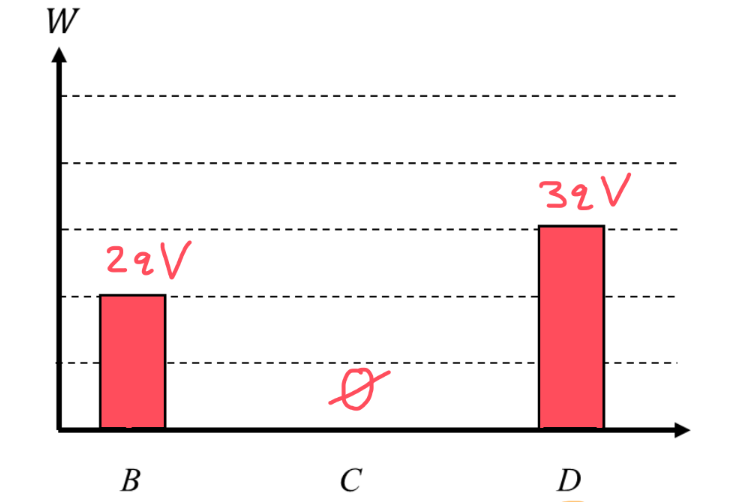
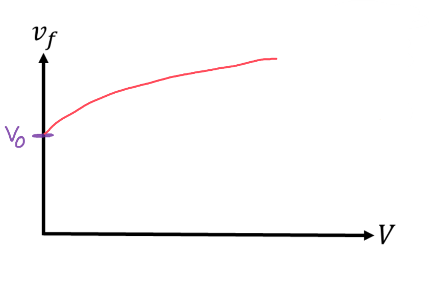

[Scoring Guidelines for Wisusik.EMAG.TBR.005]{.underline}

**Highest Possible Score:** 12 Points

a.) 3 Points

  -----------------------------------------------------------------------
  For drawing and labeling a bar of height $2qV$ at Point B      1 Point
  -------------------------------------------------------------- --------
  For drawing and labeling a bar of height $0$ at Point C        1 Point

  For drawing and labeling a bar of height $3qV$ at Point C      1 Point
  -----------------------------------------------------------------------

*[Example Solution]{.underline}*

{width="6.5in"
height="4.375in"}

b.) 4 Points

+--------------------------------------------------------------+-------+
| For a multistep derivation beginning with conservation of    | 1     |
| energy                                                       | Point |
+==============================================================+=======+
| For an indication that $\Delta U = q\Delta V$                | 1     |
|                                                              | Point |
+--------------------------------------------------------------+-------+
| For correct expressions for the change in potential and      | 1     |
| kinetic energy,                                              | Point |
|                                                              |       |
| $\Delta U = \  - 3qV$ and                                    |       |
| $\                                                           |       |
| Delta K = \frac{1}{2}m{v_{f}}^{2} - \frac{1}{2}m{v_{0}}^{2}$ |       |
+--------------------------------------------------------------+-------+
| For a final answer consistent with $\Delta U$                | 1     |
|                                                              | Point |
| (Correct final answer: $v_{f} =$ )                           |       |
+--------------------------------------------------------------+-------+

*[Example Solution]{.underline}*

$\Delta K = \  - \Delta U$

$\frac{1}{2}m{v_{f}}^{2} - \frac{1}{2}m{v_{0}}^{2} = \  - ( - 3qV)$

$\frac{1}{2}m{v_{f}}^{2} - \frac{1}{2}m{v_{0}}^{2} = \ 3qV$

$\frac{1}{2}m{v_{f}}^{2} = \frac{1}{2}m{v_{0}}^{2} + \ 3qV$

${v_{f}}^{2} = {v_{0}}^{2} +$ $\frac{6qV}{m}$

${v_{f}}^{} = ({v_{0}}^{2} +$ $\frac{6qV}{m}$$)^{1/2}$

c.) 3 Points

  -----------------------------------------------------------------------
  For a graph with a labeled y-intercept of $v_{0}$              1 Point
  -------------------------------------------------------------- --------
  For an increasing graph                                        1 Point

  For a concave down graph                                       1 Point
  -----------------------------------------------------------------------

*[Example Solution]{.underline}*

{width="6.5in"
height="4.402777777777778in"}

d.) 2 Points

  -----------------------------------------------------------------------
  For indicating the y-intercept will not change                 1 Point
  -------------------------------------------------------------- --------
  For indicating the graph will now decrease                     1 Point

  -----------------------------------------------------------------------

*[Example Solution]{.underline}*

*\*Scoring Note\**

*No justification is required*

*The y-intercept will stay the same, since there will still be no net
change in potential*

*The curve will now decrease instead of increase, since a positive
charge is being pushed towards a higher electric potential*
