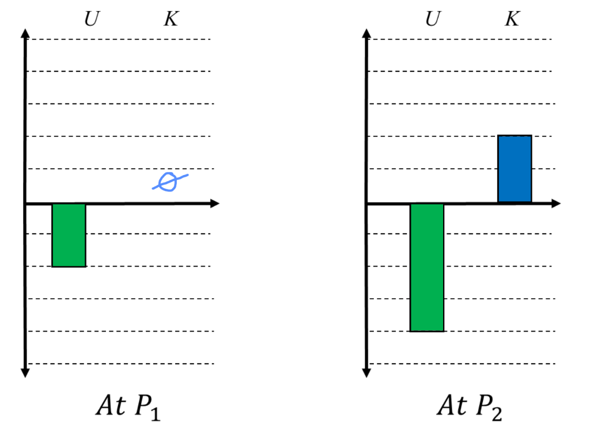
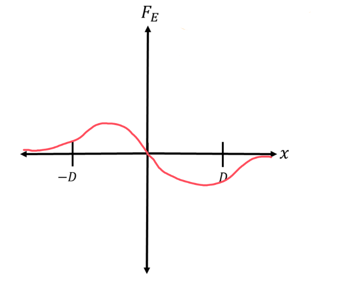

[Scoring Guidelines for Wisusik.EMAG.TBR.006]{.underline}

**Highest Possible Score:** 12 Points

a.) 3 Points

  -----------------------------------------------------------------------
  For a negative potential energy value, and zero kinetic energy 1 Point
  value at $P_{1}$                                               
  -------------------------------------------------------------- --------
  For indicating the potential energy decreases between $P_{1}$  1 Point
  and $P_{2}$                                                    

  For ensuring $K + U =$ Constant                                1 Point
  -----------------------------------------------------------------------

*[Example Solution]{.underline}*

{width="6.817708880139983in"
height="5.02587489063867in"}

b.) 4 Points

+--------------------------------------------------------------+-------+
| For a multistep derivation beginning with conservation of    | 1     |
| energy                                                       | Point |
+==============================================================+=======+
| For a correct expression for the change in electric          | 1     |
| potential of the ring, equivalent to $\Delta V =$            | Point |
| $\frac{Q}{R}$ $-$ $\frac{Q}{}$ $$                            |       |
+--------------------------------------------------------------+-------+
| For identifying that $Q = \  - 2\pi R\ \lambda$              | 1     |
|                                                              | Point |
+--------------------------------------------------------------+-------+
| For a final answer consistent with indicated values of $Q$   | 1     |
| and $\Delta V$                                               | Point |
|                                                              |       |
| Correct final answer:                                        |       |
|                                                              |       |
| $v_{f} =$ $\ $                                               |       |
|                                                              |       |
| or $v_{f} =$ $\ $                                            |       |
|                                                              |       |
| *\*Scoring note\**                                           |       |
|                                                              |       |
| *This point can still be earned for incorrect values for*    |       |
| $Q$ *and* $V$ *as long as the supporting algebra is correct* |       |
+--------------------------------------------------------------+-------+

*[Example Solution]{.underline}*

$K_{0} + U_{0} = K_{f} + U_{f}$

$0 + qV_{0} = \frac{1}{2}mv^{2} + qV_{f}$

$\frac{1}{2}m{v_{f}}^{2} = q\Delta V$

$V =$ $\int_{}^{}$ $\frac{k\ dq}{r}$

$= k$ $\int_{}^{}$ $\frac{\ dq}{}$

$=$ $\frac{\ k}{}$ $\int_{}^{}dq$

$=$ $\frac{\ kQ_{Tot}}{}$

$Q = \  - \lambda*l = \  - \lambda(2\pi R)$

$\frac{1}{2}m{v_{f}}^{2} = q($ $\frac{\ kQ}{}\ $ $-$
$\frac{\ kQ}{}\ $$)$

$\frac{1}{2}m{v_{f}}^{2} = kQq($ $\frac{\ 1}{R}\ $ $-$
$\frac{\ 1}{}\ $$)$

$v_{f} =$ $\ $

$v_{f} =$ $\ $ or $v_{f} =$ $\ $

c.) 3 Points

  -----------------------------------------------------------------------
  For drawing a continuous function                              1 Point
  -------------------------------------------------------------- --------
  For drawing an odd function that is positive when $x < 0$ and  1 Point
  negative when $x > 0$                                          

  For drawing a function that passes through the origin          1 Point
  -----------------------------------------------------------------------

*[Example Solution]{.underline}*

{width="6.5in"
height="5.569444444444445in"}

d.) 2 Points

  -----------------------------------------------------------------------
  For indicating the particle will not reach an infinite         1 Point
  distance away                                                  
  -------------------------------------------------------------- --------
  For a valid justification using the graph                      1 Point

  -----------------------------------------------------------------------

*[Example Solution]{.underline}*

*The particle will not reach an infinite distance from the ring.*

*The graph of the electric force vs distance is an odd function. As the
particle moves*

*beginning from* $x = D$*, the kinetic energy gained from moving
towards* $x = 0$ *will be lost*

*as the particle moves away from* $x = 0$*. This is shown with the equal
and opposite*

*areas under the graph. As such, the particle will oscillate between*
$x = \  \pm D$ *forever.*
