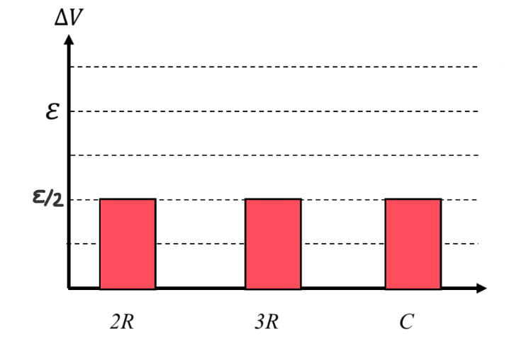
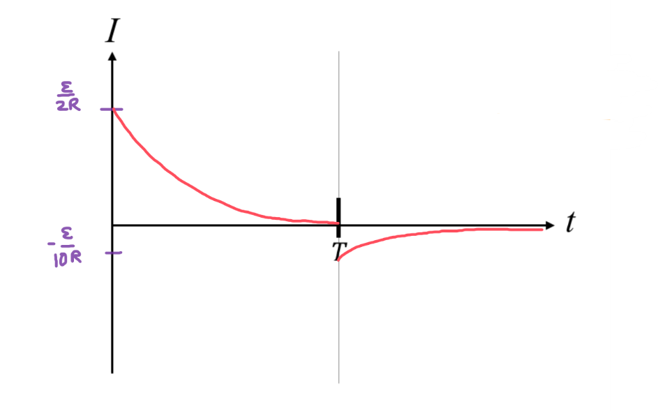

[Scoring Guidelines for Wisusik.EMAG.TBR.007]{.underline}

**Highest Possible Score:** 12 Points

a.) 3 Points

  -----------------------------------------------------------------------
  For indicating $\Delta V_{2R} =$$\ \varepsilon$$/2$            1 Point
  -------------------------------------------------------------- --------
  For indicating ${\Delta V}_{3R} = \Delta V_{C}$                1 Point

  For indicating ${\Delta V}_{2R} + \Delta V_{3R} =$             1 Point
  $\varepsilon$                                                  
  -----------------------------------------------------------------------

*[Example Solution]{.underline}*

{width="6.410843175853018in"
height="4.3571041119860014in"}

b.) 4 Points

  -----------------------------------------------------------------------
  For writing a differential equation equivalent to              1 Point
  $\frac{Q}{C}$ $+ 5R$ $\frac{dQ}{dt}$$\  = 0$                   
  -------------------------------------------------------------- --------
  For writing a relationship in the form                         1 Point
  $V = V_{Max}e^{- t/\tau}$                                      

  For indicating $\tau = 5\ RC$                                  1 Point

  For indicating a value of $V_{Max}$ consistent with            1 Point
  $\Delta V_{C}$ in part (a.)                                    
  -----------------------------------------------------------------------

*[Example Solution]{.underline}*

$\sum_{}^{}\ \Delta V = 0$

$\Delta V_{C} - \Delta V_{5R} = 0$

$\frac{Q}{C}$ $- I\ (5R) = 0$

$\frac{Q}{C}$ $-$ $( - \frac{dQ}{dt})$ $(5R) = 0$

$\frac{Q}{C}$ $+ 5R$ $\frac{dQ}{dt}$$\  = 0$

$\frac{dQ}{dt}$$\  =$ $\frac{- 1}{5RC}$ $Q$

$Q = Q_{Max}e^{- t/5RC}$

$V =$ $\frac{Q}{C}$

$V = V_{Max}e^{- t/5RC}$

$V =$ $\frac{\varepsilon}{2}$ $e^{- t/5RC}$

c.) 3 Points

+--------------------------------------------------------------+-------+
| For a graph that approaches zero as $t \rightarrow \infty$   | 1     |
|                                                              | Point |
+==============================================================+=======+
| For a graph that is positive when $t < T$, and negative when | 1     |
| $t > T$                                                      | Point |
+--------------------------------------------------------------+-------+
| For labeling values of $I(0)$ and $I(T)$ such that           | 1     |
| $|\ I(0)\ | > |\ I(T)\ |$                                    | Point |
|                                                              |       |
| *\*Scoring Note\**                                           |       |
|                                                              |       |
| *The labeled values do not need to be correct to earn this   |       |
| point*                                                       |       |
+--------------------------------------------------------------+-------+

*[Example Solution]{.underline}*

{width="6.960699912510936in"
height="4.339282589676291in"}

d.) 2 Points

  -----------------------------------------------------------------------
  For a valid method that uses the graph to calculate the total  1 Point
  charge                                                         
  -------------------------------------------------------------- --------
  For a valid justification                                      1 Point

  -----------------------------------------------------------------------

*[Example Solution 1]{.underline}*

-   *Compute the total area under the graph of* $I(t)$ *from* $t = 0$
    *to* $t = T$

<!-- -->

-   *Since* $I =$ $\frac{dq}{dt}$*, the area under the current graph
    will yield the total charge*

*[Example Solution 2]{.underline}*

-   *Find the time it takes the current to decay to 37% of its initial
    value. This is the value of the time constant,* $\tau$*\
    *

-   *Since* $\tau = 5RC$*, this allows the value of* $C$ *to be
    determined*

-   *Once the capacitance is known, solve for the charge on the
    capacitor by substituting the maximum capacitor voltage into the
    equation* $Q = C\Delta V$
