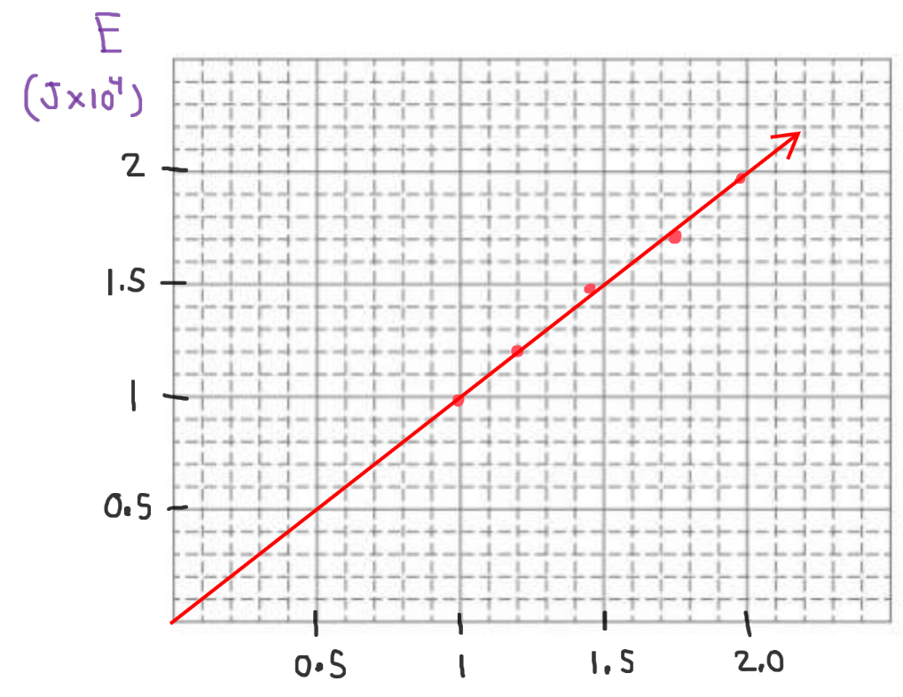

[Scoring Guidelines for Wisusik.EMAG.LAB.001]{.underline}

**Highest Possible Score:** 10 Points

a.) 2 Points

  -----------------------------------------------------------------------
  For describing an experiment in which indicating the voltage   1 Point
  and current across the bulb should be measured                 
  -------------------------------------------------------------- --------
  For indicating that multiple trials should be performed, with  1 Point
  the current and/or the voltage across the bulb being measured  

  -----------------------------------------------------------------------

*[Example Solution]{.underline}*

-   *Create a simple circuit using the bulb and the power supply.*

-   *Wire a voltmeter in parallel with the light bulb, and wire an
    ammeter in series with the bulb.*

-   *Vary the power supply voltage, and record values of voltage across,
    and current passing through the bulb. Perform multiple trials to
    reduce uncertainty*

b.) 2 Points

  -----------------------------------------------------------------------
  For a statement of Ohm's Law in terms of linearity             1 Point
  -------------------------------------------------------------- --------
  For a valid method of using the data to determine whether the  1 Point
  bulb is Ohmic                                                  

  -----------------------------------------------------------------------

*[Example Solution 1]{.underline}*

-   *Ohm's Law states that current and voltage form a linear
    relationship*

-   *Graph current as a function of voltage. If the data forms a linear
    graph, then the bulb is Ohmic*

*[Example Solution 2]{.underline}*

-   *Ohm's Law states that current and voltage form a linear
    relationship*

-   *Perform a power regression. If the power regression exponent is
    approximately equal to 1, then the bulb is Ohmic*

c.) 4 Points

i.) 1 Point

+--------------------------------------------------------------+-------+
| For a correct choice of quantities that could be graphed to  | 1     |
| yield a straight line                                        | Point |
|                                                              |       |
| with the same functional dependence as $E\ vs\ I^{2}$        |       |
+==============================================================+=======+
+--------------------------------------------------------------+-------+

*[Example Solution]{.underline}*

$P = I\Delta V$

$P = I(IR)$

$P = I^{2}R$

$E = \int_{}^{}P\ dt$

$E = Pt$

$E = I^{2}Rt$

$\lbrack E\rbrack = (Rt)*\lbrack I^{2}\rbrack$

ii.) 3 Points

  -----------------------------------------------------------------------
  For using a set of properly labeled axes (with a scale +       1 Point
  units), and using at least half of the available grid space    
  -------------------------------------------------------------- --------
  For correctly transforming and plotting the data using the     1 Point
  quantities indicated in part (i.)                              

  For drawing a best fit line that approximates the data         1 Point
  -----------------------------------------------------------------------

*[Example Solution]{.underline}*

{width="7.214078083989501in"
height="5.5608519247594055in"}

d.) 2 Points

+--------------------------------------------------------------+-------+
| For correctly relating the slope of the line to the          | 1     |
| resistance of the bulb                                       | Point |
+==============================================================+=======+
| For a final answer consistent with the slope of the line     | 1     |
| graphed and identified relationship                          | Point |
|                                                              |       |
| (Correct Final Answer: $R \approx \ 75\ \Omega$)             |       |
+--------------------------------------------------------------+-------+

*[Example Solution]{.underline}*

$\lbrack E\rbrack = (Rt)*\lbrack I^{2}\rbrack$

Linear Regression: $y = (0.91 \times 10^{4})x + (0.01 \times 10^{4})$

$Slope = Rt$

$R =$ $\frac{Slope}{t}$

$=$ $\frac{(0.91 \times 10^{4})\ \ J/A^{2}}{120\ s}$

$=$ $75.8\ \Omega$
