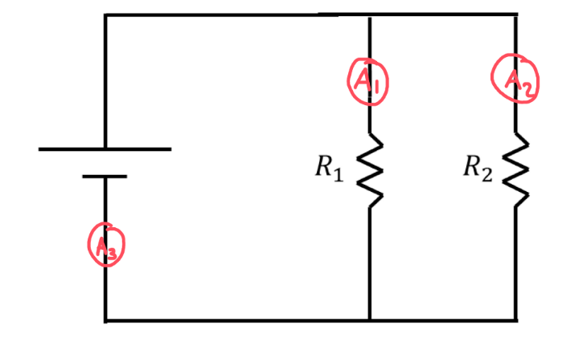
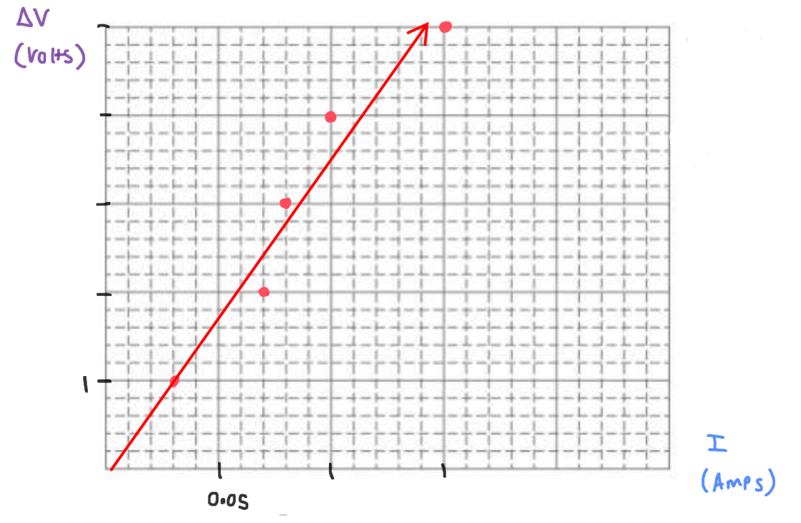

[Scoring Guidelines for Wisusik.EMAG.LAB.002]{.underline}

**Highest Possible Score:** 10 Points

a.) 2 Points

  -----------------------------------------------------------------------
  For indicating that the current should be measured in multiple 1 Point
  locations                                                      
  -------------------------------------------------------------- --------
  For a correct placement of ammeters that would measure the     1 Point
  three unique currents in the circuit                           

  -----------------------------------------------------------------------

*[Example Solution]{.underline}*

-   *Place one ammeter in series with* $R_{1}$

-   *Place one ammeter in series with* $R_{2}$

-   *Place one ammeter in series with the battery*

-   *Record the currents* $I_{1}$*,* $I_{2}$*, and* $I_{Battery}$

{width="5.373436132983377in"
height="3.1335115923009624in"}

b.) 2 Points

  -----------------------------------------------------------------------
  For a valid statement of Kirchoff's Junction Rule              1 Point
  -------------------------------------------------------------- --------
  For a valid method of using the measurements from part (a.) to 1 Point
  verify the rule                                                

  -----------------------------------------------------------------------

*[Example Solution]{.underline}*

-   *Kirchoff's Junction Rule states the the total current flowing into
    and out of a junction point must be equal*

-   *Use the ammeter measurements to find the currents* $I_{1}$*,*
    $I_{2}$*, and* $I_{Battery}$

-   *If* $I_{1} + \ $$I_{2} \approx$${\ I}_{Battery}$*, then the
    junction rule is satisfied*

c.) 4 Points

i.) 1 Point

+--------------------------------------------------------------+-------+
| For a correct choice of quantities that could be graphed to  | 1     |
| yield a straight line                                        | Point |
|                                                              |       |
| with the same functional dependence as $\Delta V$ vs $I$     |       |
+==============================================================+=======+
+--------------------------------------------------------------+-------+

*[Example Solution]{.underline}*

$\sum_{}^{}\Delta V = 0$

$\varepsilon$ $- \Delta V_{R} - \Delta V_{r} = 0$

$\Delta V$ $- IR - Ir = 0$

$\Delta V$ $= I(R + r)$

$\lbrack\Delta V\rbrack$ $= (R + r)\ \lbrack I\rbrack$

ii.) 3 Points

  -----------------------------------------------------------------------
  For using a set of properly labeled axes (with a scale +       1 Point
  units), and using at least half of the available grid space    
  -------------------------------------------------------------- --------
  For correctly transforming and plotting the data using the     1 Point
  quantities indicated in part (i.)                              

  For drawing a best fit line that approximates the data         1 Point
  -----------------------------------------------------------------------

*[Example Solution]{.underline}*

{width="7.4458628608923885in"
height="4.8684492563429576in"}

d.) 2 Points

+--------------------------------------------------------------+-------+
| For correctly relating the slope of the line to the internal | 1     |
| resistance of the power supply                               | Point |
+==============================================================+=======+
| For a final answer consistent with the slope of the line     | 1     |
| graphed and identified relationship                          | Point |
|                                                              |       |
| (Correct Final Answer: $r \approx \ 15\ \Omega$)             |       |
+--------------------------------------------------------------+-------+

*[Example Solution]{.underline}*

$\lbrack\Delta V\rbrack$ $= (R + r)\ \lbrack I\rbrack$

Linear Regression: $y = (35.0)x - (0.01)$

$Slope = R + r$

$R = \ Slope - R$

$= \ 35\ \Omega - 20\ \Omega$

$=$ $15\ \Omega$
