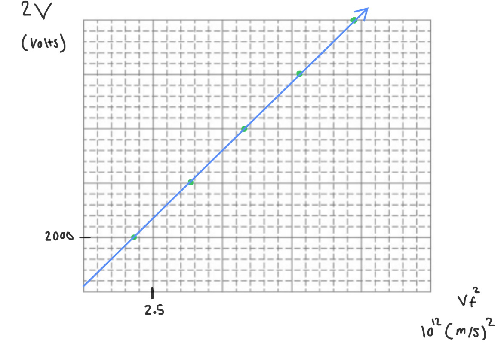

[Scoring Guidelines for Wisusik.EMAG.LAB.004]{.underline}

**Highest Possible Score:** 10 Points

a.) 2 Points

  -----------------------------------------------------------------------
  For indicating the electric field strength should be measured  1 Point
  at a variety of different distances $r$                        
  -------------------------------------------------------------- --------
  For a valid method of reducing experimental uncertainty        1 Point

  -----------------------------------------------------------------------

*[Example Solution]{.underline}*

-   *Place the electric field probe at various distances* $r$*, and
    measure the resulting electric field strength* $E$ *at each
    location*

-   *To reduce uncertainty, perform multiple trials for each value of*
    $r$*, and take the average electric field strength*

*\
*

b.) 2 Points

  -----------------------------------------------------------------------
  For performing a valid attempt at a linearization or power     1 Point
  regression                                                     
  -------------------------------------------------------------- --------
  For a valid interpretation on how to verify/refute the         1 Point
  relationship                                                   

  -----------------------------------------------------------------------

*[Example Solution 1]{.underline}*

-   *Graph the electric field of each cylinder as a function of*
    $\frac{1}{}$

-   *If the relationship is approximately linear, then the claim is
    true*

*[Example Solution 2]{.underline}*

-   *Perform a power regression on the data set of*
    $Electric\ Field\ vs\ Distance$

-   *If the regression exponent is approximately* $- 0.5$*, then the
    claim is accurate*

c.) 4 Points

i.) 1 Point

+--------------------------------------------------------------+-------+
| For a correct choice of quantities that could be graphed to  | 1     |
| yield a straight line                                        | Point |
|                                                              |       |
| with the same functional dependence as                       |       |
| $\Delta V\ \ \ \ vs\ \ \ \ \ {v_{f}}^{2}$                    |       |
+==============================================================+=======+
+--------------------------------------------------------------+-------+

*[Example Solution]{.underline}*

$\Delta K = \  - \Delta U$

$\frac{1}{2}m{v_{f}}^{2} - 0 = \  - q( - \Delta V)$

$\frac{1}{2}m{v_{f}}^{2} = \ q\ \Delta V$

$m{v_{f}}^{2} = \ 2q\ \Delta V$

$\frac{m}{q}$ ${v_{f}}^{2} = \ 2\ \Delta V$

$\ 2\ \Delta V =$ $\frac{m}{q}$ ${v_{f}}^{2}$

$\lbrack\ 2\ \Delta V\rbrack =$ $(\frac{m}{q})$
$\lbrack{v_{f}}^{2}\rbrack$

ii.) 3 Points

  -----------------------------------------------------------------------
  For using a set of properly labeled axes (with a scale +       1 Point
  units), and using at least half of the available grid space    
  -------------------------------------------------------------- --------
  For correctly transforming and plotting the data using the     1 Point
  quantities indicated in part (i.)                              

  For drawing a best fit line that approximates the data         1 Point
  -----------------------------------------------------------------------

*[Example Solution]{.underline}*

{width="7.70445428696413in"
height="5.43579615048119in"}

d.) 2 Points

+--------------------------------------------------------------+-------+
| For correctly relating the slope of the line to the          | 1     |
|                                                              | Point |
+==============================================================+=======+
| For a final answer consistent with the slope of the line     | 1     |
| graphed and identified relationship                          | Point |
|                                                              |       |
| (Correct Final Answer: $\frac{m}{q}$                         |       |
| $\approx \ 10^{- 9}\ \ kg/C$ )                               |       |
+--------------------------------------------------------------+-------+

*[Example Solution]{.underline}*

$\lbrack\ 2\ \Delta V\rbrack =$ $(\frac{m}{q})$
$\lbrack{v_{f}}^{2}\rbrack$

Linear Regression:
$y = (1043 \times 10^{- 12})x + (0.01 \times 10^{- 12})$

$Slope =$ $\frac{m}{q}$

$\frac{m}{q}$ $=$ $1.04 \times 10^{- 9}\ \ kg/C$
