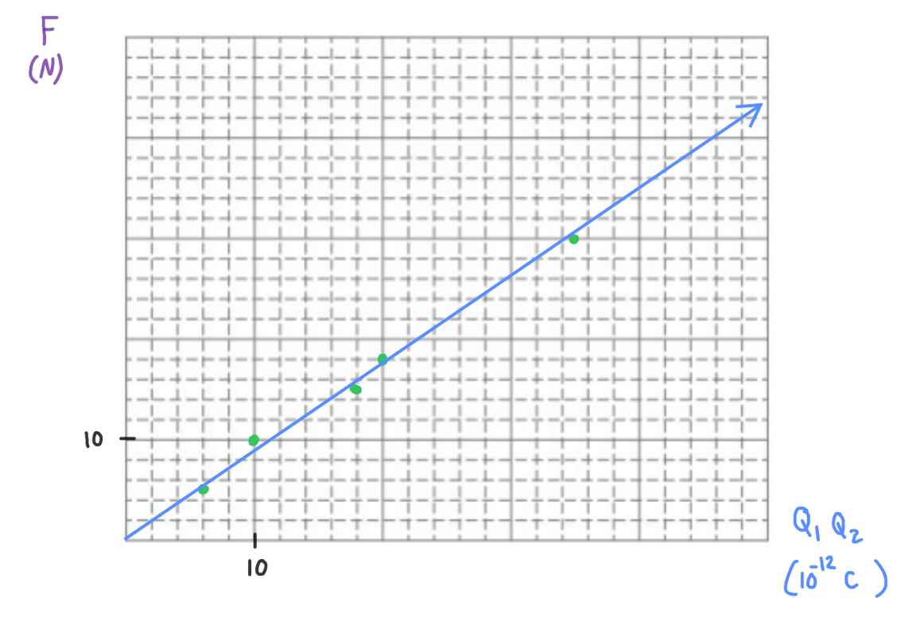

[Scoring Guidelines for Wisusik.EMAG.LAB.005]{.underline}

**Highest Possible Score:** 10 Points

a.) 2 Points

  -----------------------------------------------------------------------
  For a valid procedure that would yield different results       1 Point
  depending on the charge of the unknown sphere                  
  -------------------------------------------------------------- --------
  For a procedure that involves testing the unknown sphere using 1 Point
  *both* Sphere P and Sphere N                                   

  -----------------------------------------------------------------------

*[Example Solution]{.underline}*

-   *Attach the sphere of unknown charge to a string*

-   *Bring Sphere P near the hanging sphere. Record whether the sphere
    is attracted or repelled*

-   *Bring Sphere N near the hanging sphere. Record whether the sphere
    is attracted or repelled\
    *

b.) 2 Points

  -----------------------------------------------------------------------
  For a valid way to conclude if the sphere is positively or     1 Point
  negatively charged                                             
  -------------------------------------------------------------- --------
  For a valid way to conclude if the sphere is electrically      1 Point
  neutral                                                        

  -----------------------------------------------------------------------

*[Example Solution]{.underline}*

-   *If the test sphere is repelled by Sphere P, the sphere it is
    positively charge*

-   *If the test sphere is repelled by Sphere N, the sphere it is
    negatively charged*

-   *If the test sphere is attracted to both spheres, the sphere is
    electrically neutral*

c.) 4 Points

i.) 1 Point

+--------------------------------------------------------------+-------+
| For a correct choice of quantities that could be graphed to  | 1     |
| yield a straight line                                        | Point |
|                                                              |       |
| with the same functional dependence as                       |       |
| $F\ \ \ vs\ \ \ \ Q_{1}Q_{2}$                                |       |
+==============================================================+=======+
+--------------------------------------------------------------+-------+

*[Example Solution 1]{.underline}*

$F =$ $\frac{Q_{1}Q_{2}}{4\pi\varepsilon_{0}{\ d}^{2}}$

$\lbrack F\rbrack =$ $(\frac{1}{4\pi\varepsilon_{0}{\ d}^{2}})$
${\lbrack Q}_{1}Q_{2}\rbrack$

*[Example Solution 2]{.underline}*

$F =$ $\frac{Q_{1}Q_{2}}{4\pi\varepsilon_{0}{\ d}^{2}}$

$\varepsilon_{0}F =$ $\frac{Q_{1}Q_{2}}{4\pi{\ d}^{2}}$

$\lbrack\frac{Q_{1}Q_{2}}{4\pi{\ d}^{2}}\rbrack$${\  = (\varepsilon}_{0})\lbrack F\rbrack$

ii.) 3 Points

  -----------------------------------------------------------------------
  For using a set of properly labeled axes (with a scale +       1 Point
  units), and using at least half of the available grid space    
  -------------------------------------------------------------- --------
  For correctly transforming and plotting the data using the     1 Point
  quantities indicated in part (i.)                              

  For drawing a best fit line that approximates the data         1 Point
  -----------------------------------------------------------------------

*[Example Solution]{.underline}*

{width="7.415871609798775in"
height="5.0865277777777775in"}

d.) 2 Points

+--------------------------------------------------------------+-------+
| For correctly relating the slope of the line to the          | 1     |
| permittivity of free space                                   | Point |
+==============================================================+=======+
| For a final answer consistent with the slope of the line     | 1     |
| graphed and identified relationship                          | Point |
|                                                              |       |
| (Correct Final Answer:                                       |       |
| $\varepsilon_{0}\ $$\approx \ 9 \times 10^{- 12}$            |       |
| $C^{2}/Nm^{2}$)                                              |       |
+--------------------------------------------------------------+-------+

*[Example Solution]{.underline}*

$\lbrack F\rbrack =$ $(\frac{1}{4\pi\varepsilon_{0}{\ d}^{2}})$
${\lbrack Q}_{1}Q_{2}\rbrack$

$y = (8.42 \times 10^{11})x + (0.006)$

$Slope =$ $(\frac{1}{4\pi\varepsilon_{0}{\ d}^{2}})$

$4\pi d^{2}*$$\ Slope =$ $\frac{1}{\varepsilon_{0}}$

$\varepsilon_{0} =$$\ (4\pi d^{2}*$$\ Slope)^{- 1}$

$=$$\ (4\pi(0.1\ m)^{2}*(8.42 \times 10^{11})$$\ N/C^{2})^{- 1}$

$\varepsilon_{0} =$ $\ 9.45 \times 10^{- 12}$ $C^{2}/Nm^{2}$
