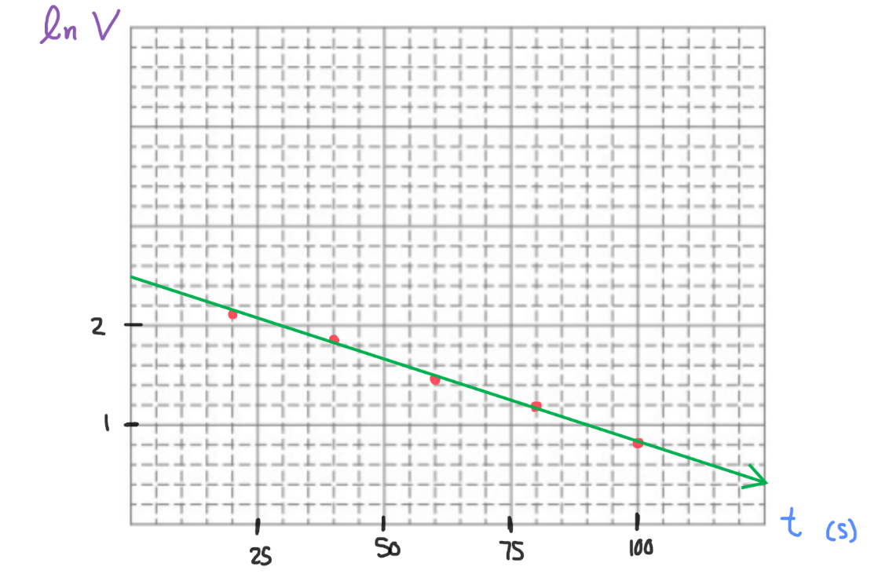

[Scoring Guidelines for Wisusik.EMAG.LAB.006]{.underline}

**Highest Possible Score:** 10 Points

a.) 2 Points

  -----------------------------------------------------------------------
  For correctly explaining how to use the pieces of foil to      1 Point
  create a capacitor                                             
  -------------------------------------------------------------- --------
  For a valid method of data collection that involves multiple   1 Point
  trials                                                         

  -----------------------------------------------------------------------

*[Example Solution 1]{.underline}*

-   *Separate two pieces of foil by a stack of paper of equal area to
    create a capacitor. Calculate the value of this area A.*

-   *Vary the thickness d of the paper stack, and record the capacitance
    C of the setup, keeping area constant*

*[Example Solution 2]{.underline}*

-   *Separate two pieces of foil by a stack of paper of equal area to
    create a capacitor. Record the separation distance d of the plates*

-   *Record the value of the capacitance* $C_{\kappa}$ *with the paper
    inserted, then record the new value of the capacitance* $C_{0}$ *by
    replacing the paper with an air gap of equal length*

b.) 2 Points

  -----------------------------------------------------------------------
  For identifying a correct relationship between capacitance and 1 Point
  the dielectric constant                                        
  -------------------------------------------------------------- --------
  For a correct method to calculate the dielectric constant from 1 Point
  the data                                                       

  -----------------------------------------------------------------------

*[Example Solution 1]{.underline}*

-   $C =$ $\frac{\kappa{A\varepsilon}_{0}}{d}$

-   *To calculate the dielectric constant, graph* $C$ *vs*
    $\frac{{A\varepsilon}_{0}}{d}$

-   *The slope of the line will be the dielectric constant*

*[Example Solution 2]{.underline}*

-   $\kappa =$ $\frac{C_{\kappa}}{C_{0}}$

-   *To calculate the dielectric constant find the average value of*
    $\frac{C_{\kappa}}{C_{0}}$ *through all trials*

c.) 4 Points

i.) 1 Point

+--------------------------------------------------------------+-------+
| For a correct choice of quantities that could be graphed to  | 1     |
| yield a straight line                                        | Point |
|                                                              |       |
| with the same functional dependence as                       |       |
| $\ln\ V\ \ \ vs\ \ \ \ t$                                    |       |
+==============================================================+=======+
+--------------------------------------------------------------+-------+

*[Example Solution]{.underline}*

$V = V_{0}{\ e}^{- t/RC}$

$\ln(V) = \ln(V_{0}{\ e}^{- t/RC})$

$\ln V = \ln({\ e}^{- t/RC}) + \ln(V_{0})$

$\lbrack\ln V\rbrack =$ $(\frac{- 1}{RC})$
$\lbrack t\rbrack + \ln V_{0}$

ii.) 3 Points

  -----------------------------------------------------------------------
  For using a set of properly labeled axes (with a scale +       1 Point
  units), and using at least half of the available grid space    
  -------------------------------------------------------------- --------
  For correctly transforming and plotting the data using the     1 Point
  quantities indicated in part (i.)                              

  For drawing a best fit line that approximates the data         1 Point
  -----------------------------------------------------------------------

*[Example Solution]{.underline}*

{width="7.672386264216973in"
height="5.053445975503062in"}

d.) 2 Points

+--------------------------------------------------------------+-------+
| For correctly relating the slope of the line to the          | 1     |
| resistance $R$                                               | Point |
+==============================================================+=======+
| For a final answer consistent with the slope of the line     | 1     |
| graphed and identified relationship                          | Point |
|                                                              |       |
| (Correct Final Answer:                                       |       |
| $R \approx 1.5 \times 10^{6}\ \Omega$)                       |       |
+--------------------------------------------------------------+-------+

*[Example Solution]{.underline}*

$\lbrack\ln V\rbrack =$ $(\frac{- 1}{RC})$
$\lbrack t\rbrack + \ln V_{0}$

$y = ( - 0.0165)x + (2.47)$

$Slope =$ $(\frac{- 1}{RC})$

$- C*$$\ Slope =$ $\frac{1}{R}$

$R =$$\ ( - C*$$\ Slope)^{- 1}$

$=$$\ ( - (40 \times 10^{- 6}\ F)*( - 0.0165\ \ *\ s^{- 1})$$\ )^{- 1}$

$R =$ $\ 1.51 \times 10^{6}$ $\Omega$
