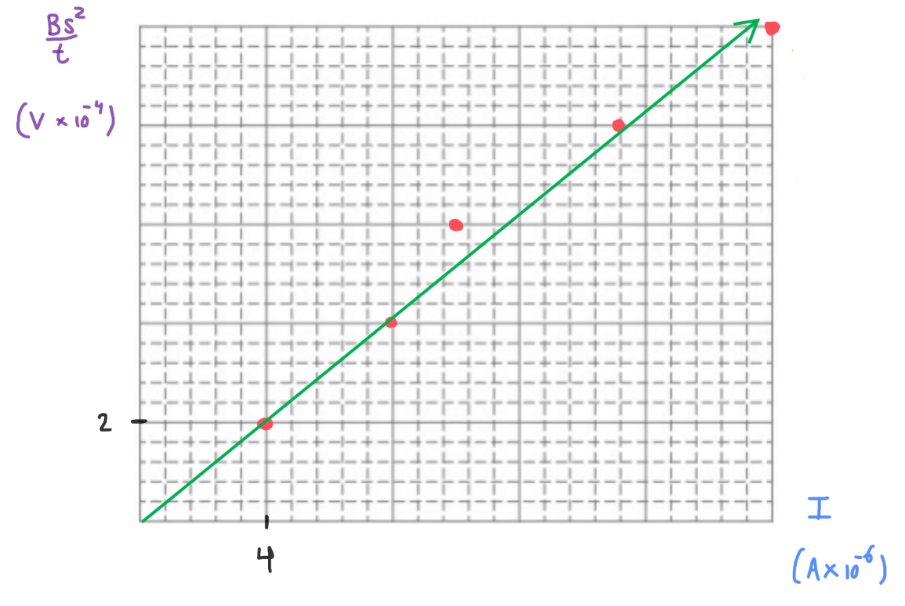

[Scoring Guidelines for Wisusik.EMAG.LAB.008]{.underline}

**Highest Possible Score:** 10 Points

a.) 2 Points

  -----------------------------------------------------------------------
  For a valid description on how to create a valid L/R circuit   1 Point
  -------------------------------------------------------------- --------
  For collecting the voltage across or current through the       1 Point
  inductor as a function of time                                 

  -----------------------------------------------------------------------

*[Example Solution]{.underline}*

-   *Create a simple circuit using a battery, resistor (of known R) and
    a switch*

-   *Attach a voltage probe in parallel to the inductor. At time t=0,
    close the switch, and record the voltage across the inductor as a
    function of time*

b.) 2 Points

  -----------------------------------------------------------------------
  For identifying the relationship $\tau = L/R$                  1 Point
  -------------------------------------------------------------- --------
  For a valid method of determining L using a graph              1 Point

  -----------------------------------------------------------------------

*[Example Solution 1]{.underline}*

-   $V_{L} = V_{0}e^{- t/(L/R)}$

-   *A graph of* $\ln V$ *vs* $t$ *would yield a straight line with
    slope equal to* $- R/L$

-   *Thus, L = -R/Slope*

*[Example Solution 2]{.underline}*

-   *Find the time constant* $\tau =$ *L/R by finding how long it takes
    for the voltage across the inductor to decay to 37% of its maximum
    value*

-   *Using the value of the time constant, solve for L using*
    $L = \ \tau*R$

c.) 4 Points

i.) 1 Point

+--------------------------------------------------------------+-------+
| For a correct choice of quantities that could be graphed to  | 1     |
| yield a straight line                                        | Point |
|                                                              |       |
| with the same functional dependence as $B_{Max}$ vs $I$      |       |
+==============================================================+=======+
+--------------------------------------------------------------+-------+

*[Example Solution]{.underline}*

$\varepsilon$ $=$ $\frac{d\Phi}{dt}$

$$$=$ $\frac{d}{dt}$ $(BA)$

$$$=$ $\frac{d}{dt}$ $(Bs^{2})$

$$$= \ s^{2}$ $\frac{dB}{dt}$

$$$= \ s^{2}$ $\frac{B_{Max}}{t}$

$\Delta V\  = IR\ $

$\lbrack\frac{B_{Max}s^{2}}{t}\rbrack$ $= (R)\lbrack I\rbrack$

ii.) 3 Points

  -----------------------------------------------------------------------
  For using a set of properly labeled axes (with a scale +       1 Point
  units), and using at least half of the available grid space    
  -------------------------------------------------------------- --------
  For correctly transforming and plotting the data using the     1 Point
  quantities indicated in part (i.)                              

  For drawing a best fit line that approximates the data         1 Point
  -----------------------------------------------------------------------

*[Example Solution]{.underline}*

{width="7.4913024934383206in"
height="5.030217629046369in"}

d.) 2 Points

+--------------------------------------------------------------+-------+
| For correctly relating the slope of the line to the          | 1     |
| resistance $R$                                               | Point |
+==============================================================+=======+
| For a final answer consistent with the slope of the line     | 1     |
| graphed and identified relationship                          | Point |
|                                                              |       |
| (Correct Final Answer: $R \approx 50\ \Omega$)               |       |
+--------------------------------------------------------------+-------+

*[Example Solution]{.underline}*

$\lbrack\frac{B_{Max}s^{2}}{t}\rbrack$ $= (R)\lbrack I\rbrack$

$y = (50.25)x + (0)$

$Slope = R$

$R = 50\ \Omega$
