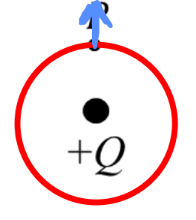

[Scoring Guidelines for Wisusik.EMAG.MR.005]{.underline}

**Highest Possible Score:** 10 Points

a.) 7 Points

i.) 2 Points

  -----------------------------------------------------------------------
  For a derivation using conservation of charge *or* an          1 Point
  indication that the net charge of the system appears on the    
  outer shell                                                    
  -------------------------------------------------------------- --------
  For a correct answer (including sign), $Q_{Out} = \  - 8Q$     1 Point

  -----------------------------------------------------------------------

*[Solution 1]{.underline}*

$Q_{Shell} = Q_{Inner} + Q_{Outer}$

$( - 9Q) = \ ( - Q) + Q_{Outer}$

$Q_{Outer} =$ $\  - 8Q$

*[Solution 2]{.underline}*

*In a conductor, the outer shell will hold the net charge of the system,
which is equal to*

$( - 9Q) + ( + Q) = \  - 8Q$

*Thus, the outer shell holds a charge of* $- 8Q$

ii.) 3 Points

*\*Scoring Note\**

*Full points are still awarded if the final answer is negative*

*[Solution 1]{.underline}*

  -----------------------------------------------------------------------
  For a multistep derivation using Gauss's Law,                  1 Point
  $\int_{}^{}E \cdot dA =$ $\frac{Q_{enc}}{\varepsilon_{0}}$     
  -------------------------------------------------------------- --------
  For using a net charge of the system consistent with the       1 Point
  answer to the previous part (which is equal to -8Q)            

  For a correct calculation of                                   1 Point
  $Q = \ 8\pi R^{2}\varepsilon_{0}E$                             
  -----------------------------------------------------------------------

*[Example Solution 1]{.underline}*

$\int_{}^{}E \cdot dA =$ $\frac{Q_{enc}}{\varepsilon_{0}}$

$\int_{}^{}E \cdot dA =$ $\frac{( - 8Q)}{\varepsilon_{0}}$

$|E| \cdot 4\pi{(4R)}^{2} =$ $\frac{| - 8Q|}{\varepsilon_{0}}$

$|E| \cdot 64\pi R^{2} =$ $\frac{8Q}{\varepsilon_{0}}$

$Q = \ 8\pi R^{2}\varepsilon_{0}E$

*[Solution 1]{.underline}*

  -----------------------------------------------------------------------
  For a multistep derivation using the electric field from a     1 Point
  point charge, $E =$ $\frac{kq}{r^{2}}$                         
  -------------------------------------------------------------- --------
  For using a net charge of the system consistent with the       1 Point
  answer to the previous part (which is equal to -8Q)            

  For a correct calculation of                                   1 Point
  $Q = \ 8\pi R^{2}\varepsilon_{0}E$                             
  -----------------------------------------------------------------------

*[Example Solution 2]{.underline}*

$|E| =$ $\frac{kq}{r^{2}}$

$=$ $\frac{k| - 8Q|}{r^{2}}$

$=$ $\frac{8kQ}{(4R)^{2}}$

$E =$ $\frac{kQ}{2R^{2}}$

$Q =$ $\frac{2{ER}^{2}}{k}$ or $Q = \ 8\pi R^{2}\varepsilon_{0}E$

iii.) 2 Points

  -----------------------------------------------------------------------
  For drawing a circular equipotential that contains point P and 1 Point
  is centered at the positive charge within the cavity           
  -------------------------------------------------------------- --------
  For drawing an electric field that points directly upwards     1 Point

  -----------------------------------------------------------------------

*[Example Solution]{.underline}*

{width="2.713542213473316in"
height="3.0458125546806647in"}

b.) 3 Points

+--------------------------------------------------------------+-------+
| For a multistep derivation involving conservation of energy  | 1     |
|                                                              | Point |
+==============================================================+=======+
| For indicating $\Delta V = \ $$- \frac{2kQ}{3R}$             | 1     |
|                                                              | Point |
+--------------------------------------------------------------+-------+
| For a final answer consistent with $\Delta V$ and involves   | 1     |
| accounting for the kinetic energy of both masses (equivalent | Point |
| to $v =$ $$ if done correctly)                               |       |
|                                                              |       |
| *\*Scoring Note\**                                           |       |
|                                                              |       |
| *This point can still be earned for an incorrect*            |       |
| $\Delta V$*, as long as the algebra is correct*              |       |
+--------------------------------------------------------------+-------+

*[Example Solution]{.underline}*

$\Delta K = \  - \Delta U = \  - q\Delta V$

$\Delta V = \  - \int_{}^{}E(r)dr$

$= \  - \int_{R/2}^{3R/4}$$\frac{kQ}{r^{2}}$ $dr$

$= \ $$- \frac{2kQ}{3R}$

$\frac{1}{2}m{v_{f}}^{2} - \frac{1}{2}m{v_{0}}^{2} = \  - q$
$( - \frac{2kQ}{3R})$

$\frac{1}{2}m{v_{f}}^{2} - \frac{1}{2}m{v_{0}}^{2} = \ $
$\frac{2kQq}{3R}$

$v =$ $$ or $v =$ $$
