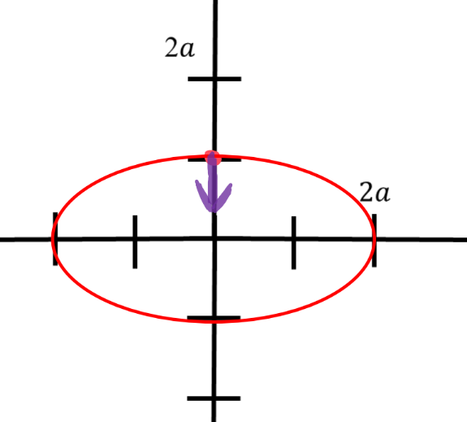

[Scoring Guidelines for Wisusik.EMAG.MR.008]{.underline}

**Highest Possible Score:** 10 Points

a.) 7 Points

i.) 2 Points

  -----------------------------------------------------------------------
  For drawing an electric field vector pointing directly down at 1 Point
  (0,a)                                                          
  -------------------------------------------------------------- --------
  For drawing an ellipse centered at the origin passing through  1 Point
  (0, a) and (2a,0)                                              

  -----------------------------------------------------------------------

*[Example Solution]{.underline}*

{width="4.859375546806649in"
height="4.386114391951006in"}

ii.) 2 Points

  -----------------------------------------------------------------------
  For stating the relationship $\Delta U = q\Delta V\ $*or*      1 Point
  identifying that both points exist on the same equipotential   
  -------------------------------------------------------------- --------
  For stating $\Delta U = 0$                                     1 Point

  -----------------------------------------------------------------------

*[Example Solution]{.underline}*

$\Delta U = q\Delta V\ $

$V(0,a) = 0^{2} + 4(a)^{2} = 4a^{2}\ $

$V(2a,0) = (2a)^{2} + 0^{2} = 4a^{2}\ $

Since $\Delta V = 0$, $\Delta U = 0$,

iii.) 3 Points

  -----------------------------------------------------------------------
  For stating the relationship $E_{x} = \  -$ $\frac{dV}{dx}$    1 Point
  -------------------------------------------------------------- --------
  For successfully finding the magnitude of each component of    1 Point
  the electric field, $|E_{x}| = \ 2b$ and $|E_{y}| = \ 8b$      

  For finding the magnitude of the total electric field using    1 Point
  the Pythagorean Theorem (for a correct answer, this gives      
  $|E| = \ \ b$                                                  
  -----------------------------------------------------------------------

*[Example Solution]{.underline}*

$E_{x} = \  -$ $\frac{dV}{dx}$

$$

$= \  -$ $\frac{\partial}{\partial x}$ $(x^{2} + 4y^{2})$

$= \  -$ $2x\ \widehat{i}$

$E_{y} = \  -$ $\frac{\partial V}{\partial y}$

$$

$= \  -$ $\frac{\partial}{\partial y}$ $(x^{2} + 4y^{2})$

$= \  -$ $8y\ \widehat{j}$

$E(b,b) = \lbrack\  - 2b,\  - 8b\rbrack$

$|E| = = \ b$

b.) 3 Points

i.) 2 Points

  -----------------------------------------------------------------------
  For answering "No", with valid justification                   1 Point
  -------------------------------------------------------------- --------

  -----------------------------------------------------------------------

*[Example Solution]{.underline}*

*This circle is not an equipotential curve. V(0,r) and V(r,0) evaluate
to different quantities*

ii.) 2 Points

  -----------------------------------------------------------------------
  For indicating the value of the path integral is zero          1 Point
  -------------------------------------------------------------- --------
  For a valid justification                                      1 Point

  -----------------------------------------------------------------------

*[Example Solution]{.underline}*

*The electric force is conservative. As such, there is no change in
potential by completing a full loop around a closed curve (Kirchoff's
Loop Rule)*

*[Alternate Solution]{.underline}*

*The above path integral evaluates to the negative of the net change in
potential. Since the path begins and ends in the same location, the net
change in potential -- and thus the integral -- is zero*
